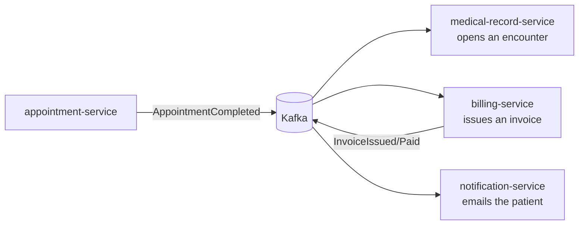
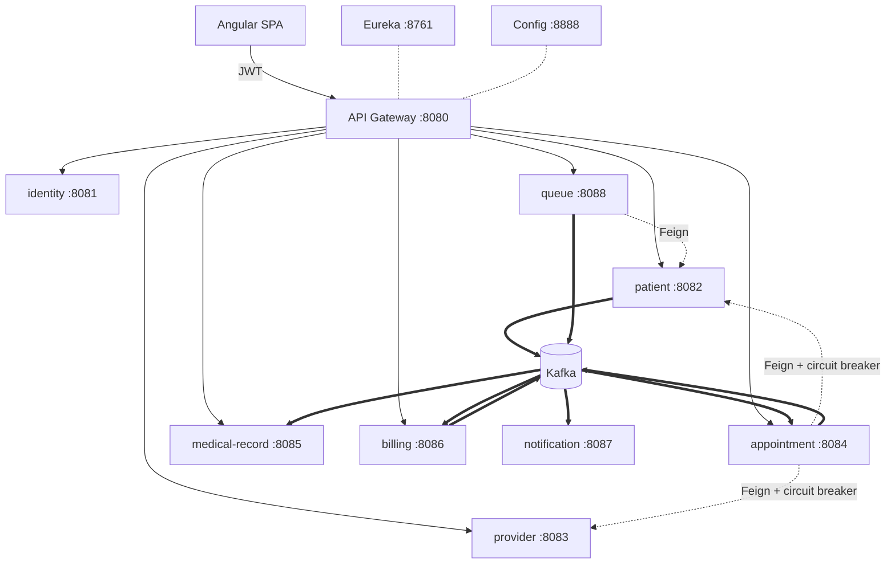

# CareConnect

**What it is:** the software a multi-specialty outpatient clinic runs on. Patients book appointments online, the front desk manages the day, doctors document what happened, and the clinic gets paid — one system, four roles, each seeing a different application.

**The problem it solves:** small clinics juggle a booking site, a paper or spreadsheet register, a separate billing tool, and WhatsApp for reminders. Nothing reconciles. Double-bookings happen, visits go unbilled, and a patient's history lives in a folder. CareConnect makes the visit the single spine: booking a slot, documenting the consultation, issuing the invoice and notifying the patient are all consequences of one appointment moving through its lifecycle.

**Who uses it**

| Role | What they do here |
|---|---|
| **Clinic administrator** | Hires doctors, sets specialties, fees and weekly hours, oversees billing |
| **Front desk / staff** | Confirms and manages the day's appointments, registers patients, collects payments |
| **Doctor** | Sees their day, writes notes, diagnoses and prescriptions, signs the chart |
| **Patient** | Finds a doctor, books a free slot, reads their history and prescriptions, pays invoices |

**Why it's built this way:** as a study in production microservice engineering — 11 services, database-per-service, event-driven integration, and the guarantees a healthcare system genuinely needs (no double-booking, no lost events, no unauthorized access to a chart). Every decision is recorded as an ADR with its alternatives and costs.

> **Not** a hospital system: no beds, wards, surgery scheduling, pharmacy stock, lab orders or insurance claims. That scope was fixed deliberately in [the vision doc](docs/product/vision.md) — a clinic done properly beats a hospital done partially.

## The one-minute version

Mark an appointment **complete**, and three services react to a single event without knowing about each other:



Adding a fourth consumer requires no change to the producer. That's the whole argument for event-driven architecture, and you can watch it happen in [the demo walkthrough](docs/operations/demo.md).

## Architecture at a glance



**8 business services + 3 platform services + 1 SPA**, each business service owning its own
database. Only the gateway and the SPA publish a port; the services sit on the internal
network behind them. Full rationale: [High-Level Design](docs/architecture/high-level-design.md) ·
[Service Catalog](docs/architecture/service-catalog.md) · [ADRs](docs/adr/README.md).

A ninth service — `laboratory-service` — was built and then **deleted**
([ADR-010](docs/adr/adr-010-remove-laboratory-service.md)). It contradicted the scope
statement below it, was the least-tested service in the repository, and split the demo
into two competing stories. Working code is not a reason to keep code.

## Engineering decisions worth reading

| Decision | Why it's interesting |
|---|---|
| **Double-booking is impossible, not merely checked** | Postgres exclusion constraint (`btree_gist`) filtered to slot-holding statuses — losing a race returns 409, and cancelling frees the slot with zero code |
| **Transactional outbox** | Events share a transaction with the state that caused them; a scheduled relay publishes using `FOR UPDATE SKIP LOCKED` ([ADR-009](docs/adr/adr-009-transactional-outbox.md)) |
| **Exactly-once *processing*** | Kafka is at-least-once; consumers write `eventId` to `processed_events` in the same transaction as the side effect |
| **Sync fails fast, async never blocks** | Booking 503s if patient/provider can't be validated; billing/notification outages are invisible to the clinic ([ADR-004](docs/adr/adr-004-sync-vs-async.md)) |
| **The chart remembers who opened it** | Every read of clinical data writes an append-only `record_access_log` row, and the **patient can see their own trail**. Access control decides who *may* read; this records who *did* — the control a clinical system is actually audited on. Fail-closed: the log write shares the read's transaction, so a chart that can't be recorded as read isn't served |
| **Authorization by relationship, not just role** | A DOCTOR token is not a skeleton key: reading one chart, listing a patient's whole history, and opening a queue console all check the *treating* relationship, not the role ([security](docs/architecture/security.md)) |
| **The gateway's word is verified, not assumed** | Services authorize from gateway-set `X-User-*` headers, so the gateway attaches a shared secret and services *strip* identity headers arriving without it — reaching a service directly can't forge an admin |
| **The lobby board is redacted server-side** | The public waiting-room screen and its SSE stream carry token numbers and given names only. Never surnames, never presenting complaints — filtering in the browser protects nobody |
| **Clinical records are append-only** | Signed encounters are immutable; corrections create amendments preserving the previous text |
| **Money is snapshotted** | Invoice amounts come from the fee captured at booking — later price changes can't rewrite history |
| **Refresh-token rotation with replay detection** | A replayed refresh token revokes the session; the SPA refreshes single-flight so it never trips its own defence |

## Tech stack

| Layer | Technology |
|---|---|
| Frontend | Angular 19 (standalone components, signals), Angular Material, RxJS |
| Backend | Java 21, Spring Boot 3.4, Spring Security, Spring Data JPA, OpenFeign, Resilience4j |
| Platform | Spring Cloud Gateway, Eureka, Spring Cloud Config |
| Data | PostgreSQL (database per service), Flyway |
| Messaging | Apache Kafka (outbox → relay → idempotent consumers) |
| Ops | Docker Compose, Actuator + Micrometer/Prometheus, Testcontainers |

## Run it

```bash
cp .env.example .env
cd backend  && ./mvnw -q package -DskipTests && cd ..   # mvnw: no local Maven needed
cd frontend && npm install && npm run build && cd ..
docker compose --profile platform up -d --build
```

Only the gateway (`:8080`) and the SPA (`:4300`) are published; the services sit on
the compose network behind them, because their authorization trusts headers the
gateway sets. Compose runs with the repository's public default secrets and says so
by setting `ALLOW_INSECURE_DEFAULTS=true` — without it, services **refuse to start**
on a known secret, so a deployment can't quietly inherit one. Put real values in
`.env` and drop that flag for anything that isn't a laptop.

The stack seeds itself: an administrator account is created, then a seeder builds a
working clinic **through the public API** — 5 doctors with weekly schedules, 6 patients,
appointments in every state, signed clinical notes, paid and outstanding invoices.
Nothing to click before the system has data in it.

Open http://localhost:4300 and sign in with one of the demo accounts listed on the
login page — each role is a different application:

| Role | Login | What you'll see |
|---|---|---|
| Administrator | `admin@careconnect.local` / `Admin12345` | Clinic dashboard, doctor management, billing console |
| Doctor | `dr.rao@careconnect.demo` / `Doctor12345` | Today's patients, charts to document and sign |
| Patient | `asha.verma@careconnect.demo` / `Patient12345` | Booking, visit history, prescriptions, invoices |

Dev mode with hot reload: `cd frontend && npm start` → http://localhost:4200
Platform internals: Eureka http://localhost:8761 · Config http://localhost:8888

Then follow [docs/operations/demo.md](docs/operations/demo.md) — it proves each guarantee by deliberately breaking things (stop Kafka, stop a dependency, double-click Pay).

## Testing

Unit tests for domain rules, `@WebMvcTest` slices for API contracts and authorization, and Testcontainers integration tests against **real Postgres and Kafka** — including the exclusion constraint under concurrent booking, replayed-event idempotency, and the event→encounter/invoice pipelines.

```bash
cd backend && ./mvnw verify        # Docker optional, but see below
```

**Read the `Skipped` count, not just `BUILD SUCCESS`.** Every Testcontainers test is
annotated `disabledWithoutDocker`, so without Docker running, 15 of them skip
silently — including all the concurrency and event-pipeline tests, which are the ones
worth having. Known coverage gaps (queue-service has none) are listed in
[the testing chapter](docs/srs/12-deployment-and-testing.md#known-gaps-in-coverage)
rather than left for you to discover.

## Documentation

Architecture-first, written and maintained alongside the code — [start here](docs/README.md).

- **[Software Requirements Specification](docs/srs/README.md)** — 27 chapters: modules, roles, permission matrix, user stories, workflows, data model, APIs, events, security, deployment, testing, roadmap
- [Roadmap](docs/ROADMAP.md) — the 9 delivered phases
- [Architecture](docs/architecture/high-level-design.md) · [Database design](docs/architecture/database-design.md) · [Communication & events](docs/architecture/communication.md) · [Security](docs/architecture/security.md)
- [ADRs 001–009](docs/adr/README.md) — every decision with alternatives and trade-offs
- [API docs](docs/api/) per service · [Troubleshooting](docs/operations/troubleshooting.md) — real failures hit during development, with causes
- [Interview notes](docs/learning/interview-notes.md) · [Learning journal](docs/learning/journal.md)

## Honest limitations

Not HIPAA-certified; no field-level encryption at rest; no mTLS between services; payments are simulated; Kubernetes, CDC-based outbox (Debezium), and a bundled Grafana stack are documented as next steps rather than built. Each is a recorded decision with reasoning — see the ADRs and the "deliberately not done" notes throughout the docs.

Specifically still missing, and known:

- **The access log is append-only by construction, not by permission.** Nothing in the code updates or deletes a row and the entity has no setters, but the database user could. The proper lock is a role with INSERT/SELECT and no UPDATE/DELETE on that table.
- **No per-account lockout.** Auth endpoints are rate-limited per client address, which slows broad guessing but not a slow, targeted attack on one known email.
- **Rate limiting is per gateway instance** (in-memory token buckets). Correct for a single gateway; a second replica would each allow the full budget.
- **CSP allows `'unsafe-inline'` for styles**, because Angular and Material inject inline styles. Scripts are `'self'` with no exemption.
- **queue-service has no tests.**
