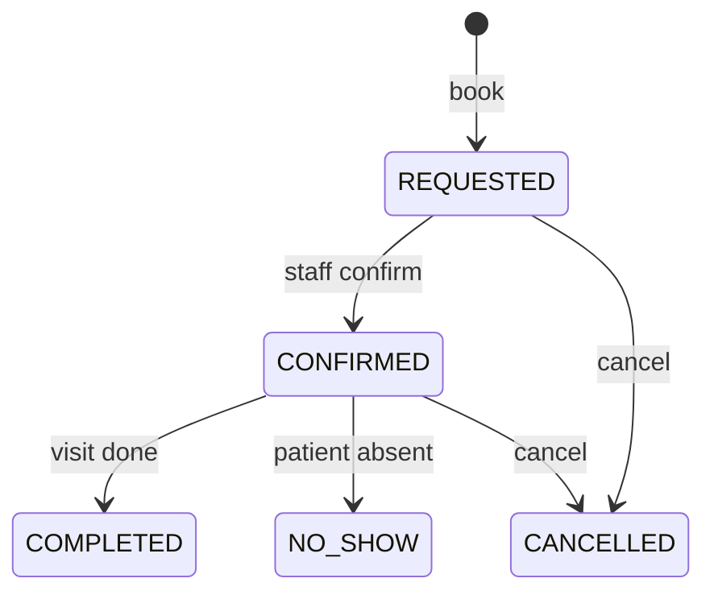

# appointment-service API

Base path via gateway: `/api/appointments`. Errors: RFC 7807. Times are ISO-8601 UTC; availability is interpreted in the clinic zone (`careconnect.clinic.zone`, default Asia/Kolkata).

| Endpoint | Roles | Purpose |
|---|---|---|
| `GET /available?doctorId=&date=` | any authenticated | Free slots = availability windows − held (REQUESTED/CONFIRMED) appointments − past times |
| `POST /` | PATIENT (self), STAFF/ADMIN (any `patientId`) | Book. Validates patient (Feign→patient), doctor/window/fee (Feign→provider). Creates REQUESTED. 409 `appointment-conflict` if the slot was just taken |
| `GET /me` | PATIENT | Own appointments, newest first, paged |
| `GET /doctor/{doctorId}?date=` | STAFF, ADMIN, DOCTOR | Day schedule |
| `GET /doctor/requests` | DOCTOR | **The doctor's own inbox** — requests awaiting their decision |
| `POST /{id}/acceptance` | DOCTOR (own only) | Doctor accepts: REQUESTED → CONFIRMED |
| `POST /{id}/decline` | DOCTOR (own only) | Doctor declines: slot freed, patient notified |
| `POST /{id}/confirmation` | STAFF, ADMIN | Front desk confirms on the doctor's behalf |
| `POST /{id}/completion` | STAFF, ADMIN, DOCTOR | CONFIRMED → COMPLETED |
| `POST /{id}/no-show` | STAFF, ADMIN, DOCTOR | CONFIRMED → NO_SHOW |
| `POST /{id}/cancellation` | owner PATIENT (≥2h before start), STAFF/ADMIN (any time) | → CANCELLED; frees the slot |

## Lifecycle

Illegal transitions → 409 `invalid-transition`. Every change is recorded in `appointment_status_history` with the acting user.

## Design guarantees
- **No double-booking**: app-level check narrows the race; the Postgres exclusion constraint `(doctor_id, tstzrange) WHERE status IN (REQUESTED, CONFIRMED)` eliminates it. Losing the race = 409, never two bookings.
- **Fee & name snapshots** at booking time: later fee changes never alter an existing appointment (billing correctness).
- **Fail-fast on dependencies**: patient/provider down or circuit open → 503 `dependency-unavailable`; we do not book unverifiable appointments (ADR-004).
- Feign calls forward the caller's `X-User-*` headers — downstream authorizes the *original* caller; no privilege escalation.
