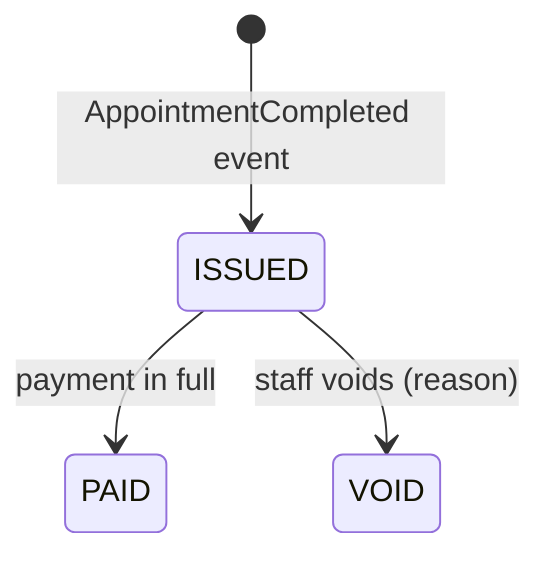

# billing-service API

Base path via gateway: `/api/invoices`. Errors: RFC 7807.

**No `POST /api/invoices`.** Invoices are generated by consuming `AppointmentCompleted`; the amount comes from the event's `fee` — snapshotted at booking time — so a later price change never alters an issued invoice.

| Endpoint | Roles | Notes |
|---|---|---|
| `GET /me` | PATIENT | Own invoices, newest first |
| `GET /?status=ISSUED\|PAID\|VOID` | STAFF, ADMIN | Work queue by status |
| `GET /{id}` | owner PATIENT, STAFF, ADMIN | 403 for other patients' invoices |
| `POST /{id}/payments` | owner PATIENT, STAFF, ADMIN | Settle in full. Body: `{amount, method, reference}` |
| `POST /{id}/void` | STAFF, ADMIN | Reason required; a PAID invoice cannot be voided (refund is a different operation) |

## Invoice lifecycle

## Money rules encoded in the domain
- `BigDecimal` everywhere, `NUMERIC(10,2)` in Postgres — binary floating point cannot represent money.
- **Payment idempotency**: `reference` is a client-generated key with a unique constraint. A retried or double-clicked payment hits 409 `duplicate-payment` instead of charging twice — the same discipline a real gateway integration demands.
- **Invoice idempotency**: unique `appointment_id` + `processed_events`, so a replayed event never double-bills a visit.
- Partial payments are rejected in v1 (a balance model would be required); paid invoices are never voided.

## Events published (`billing.events`)
`InvoiceIssued`, `InvoicePaid`, `InvoiceVoided` — consumed by notification-service, which emails the patient. This completes the chain: **appointment → billing → notification**, with each hop asynchronous and independently retryable.
