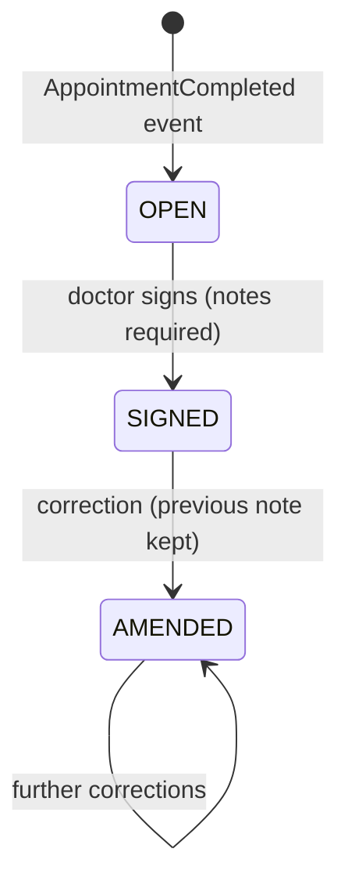

# medical-record-service API

Base path via gateway: `/api/records`. Errors: RFC 7807.

**There is no `POST /api/records`.** Encounters are created only by consuming `AppointmentCompleted` — you cannot chart a visit that never happened. Idempotent on `eventId` *and* on `appointment_id` (unique), so replays never duplicate a chart.

| Endpoint | Roles | Notes |
|---|---|---|
| `GET /me` | PATIENT | Own visit history (summaries) |
| `GET /doctor/me` | DOCTOR | Encounters where the caller is the treating doctor |
| `GET /patient/{patientId}` | DOCTOR, STAFF, ADMIN | A patient's history (summaries) |
| `GET /{id}` | any authenticated **+ relationship** | Full chart. Permitted for the treating doctor, the owning patient, or staff/admin; anyone else → 403 even with a valid token |
| `PUT /{id}` | treating DOCTOR | Chief complaint + notes; only while `OPEN` |
| `POST /{id}/diagnoses` · `POST /{id}/prescriptions` | treating DOCTOR | Only while `OPEN` |
| `POST /{id}/signature` | treating DOCTOR | `OPEN → SIGNED`; requires notes |
| `POST /{id}/amendments` | treating DOCTOR | Post-signature correction: previous text preserved with a reason, status → `AMENDED` |

## Record lifecycle

Editing a `SIGNED`/`AMENDED` record directly → 409 `record-state`. Clinical records are corrected by addition, never by erasure (FR-E2).

## Access model
Role gates the endpoint; **relationship** gates the row. `getForReader` checks treating-doctor / owning-patient / staff before returning anything — a DOCTOR token is not a skeleton key to every chart in the system.
