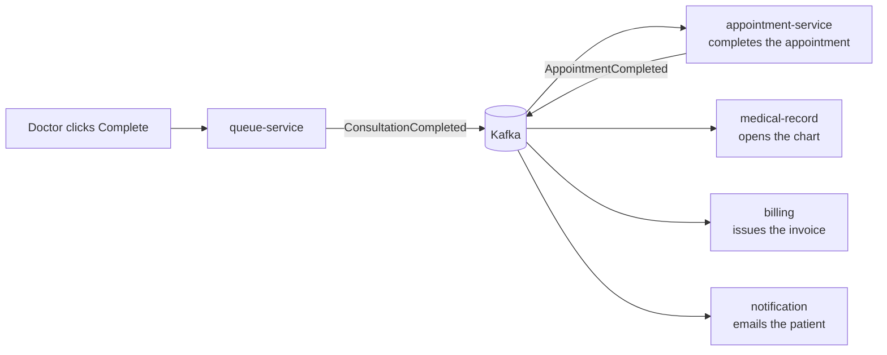

# queue-service API — Live Care Flow

Base path via gateway: `/api/queue`. The real-time OPD queue: token issuing, triage priority, wait-time prediction, and the event that drives visit completion across the whole system.

## Why this service exists
Booking tells you *when* a visit should happen. It says nothing about what patients actually experience: arriving, waiting without information, and not knowing whether they have five minutes or fifty. This service owns that reality — and because the consultation genuinely ends here, ending it is what completes the appointment everywhere else.

## Public (no auth — lobby kiosks)
| Endpoint | Purpose |
|---|---|
| `GET /stream/{doctorId}` | **Server-Sent Events**: a full queue snapshot on every change |
| `GET /board/{doctorId}` | One-off snapshot (initial paint, or polling fallback) |

Exposed without credentials on purpose: a waiting-room screen has no login, and the payload carries token numbers and names only — no clinical data.

## Joining
| Endpoint | Roles | Notes |
|---|---|---|
| `POST /check-in` | STAFF, ADMIN, PATIENT | From a booked appointment. Idempotent per appointment |
| `POST /walk-in` | STAFF, ADMIN | No appointment — the majority of real OPD traffic |

## Doctor console
| Endpoint | Roles | Notes |
|---|---|---|
| `POST /doctor/{doctorId}/call-next` | DOCTOR, STAFF, ADMIN | Calls in fairness order (priority group, then arrival) |
| `POST /{id}/recall` | DOCTOR, STAFF, ADMIN | Third unanswered call auto-skips the token |
| `POST /{id}/start` | DOCTOR, STAFF, ADMIN | Patient is in the room; the consultation clock starts |
| `POST /{id}/complete` | DOCTOR, STAFF, ADMIN | **Fires `ConsultationCompleted`** → appointment completed → chart + invoice + email |
| `POST /{id}/left` | DOCTOR, STAFF, ADMIN | Patient gave up — recorded, because walk-away rate is a quality metric |
| `POST /{id}/requeue` | DOCTOR, STAFF, ADMIN | A skipped patient reappears; rejoins at the current time |

## Patient
`GET /me` → live position, ETA and a human message ("You are next — please stay nearby").

## The wait-time model
Median of the doctor's **last 20 consultations**, falling back to a clinic default until at least 3 samples exist; outliers (<1 min, >4 h) are discarded. Median rather than mean because one long consultation shouldn't poison every subsequent estimate. ETA = `positionAhead × median`, plus half a consultation if someone is currently inside. Explainable, self-correcting through the day, and honest about being an estimate.

## Fairness rules
Priority reorders *groups*, never individuals within a group: an EMERGENCY arriving at 11:00 is called before a NORMAL who arrived at 09:00, but two EMERGENCIES are still served in arrival order. Tokens are sequential and gap-free per doctor per day (row-locked counter — patients notice missing numbers).

## Events published (`queue.events`)
`PatientCheckedIn`, `PatientCalled`, `PatientSkipped`, `ConsultationStarted`, `ConsultationCompleted`, `PatientLeft`, `PatientRequeued`.

Note the direction: queue-service never *commands* appointment-service. It states a fact; the scheduling context decides what that fact means for an appointment (ADR-004).
