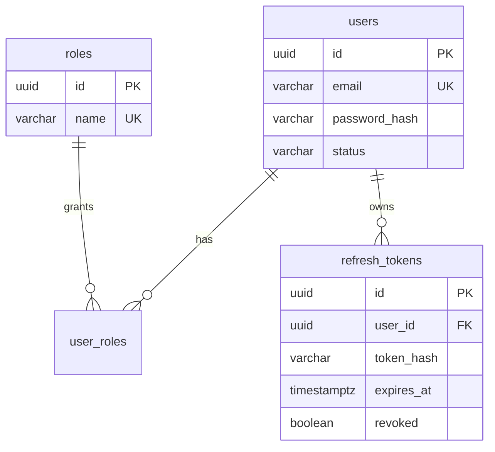
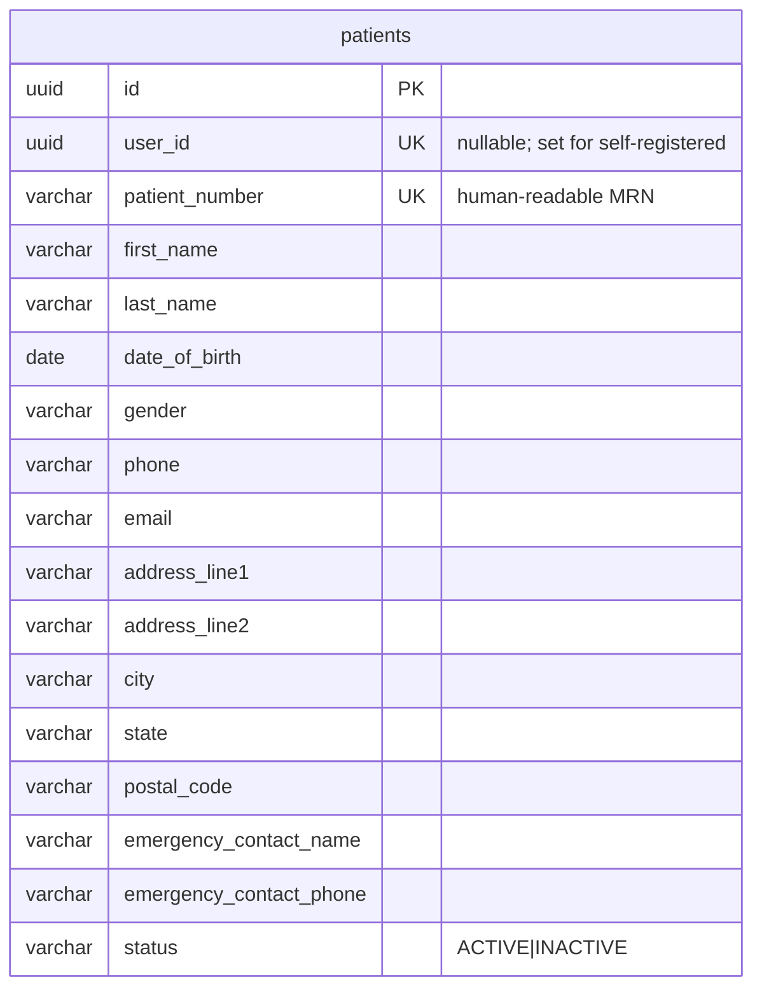
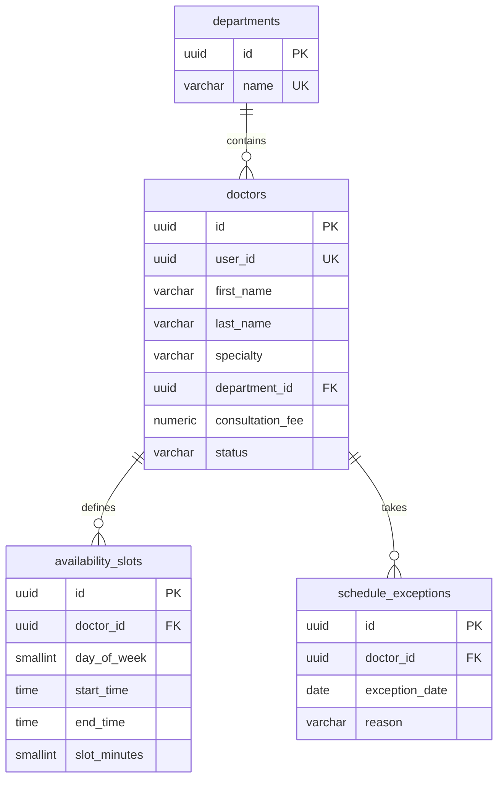
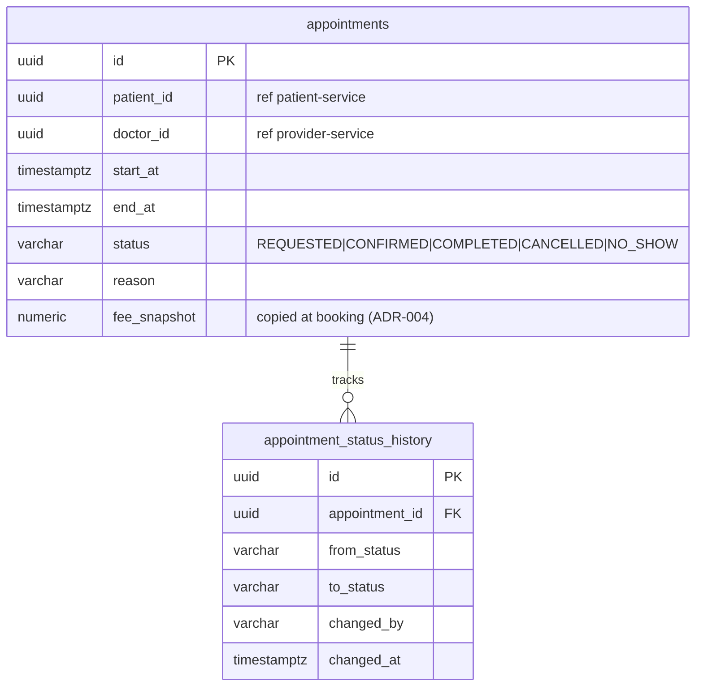
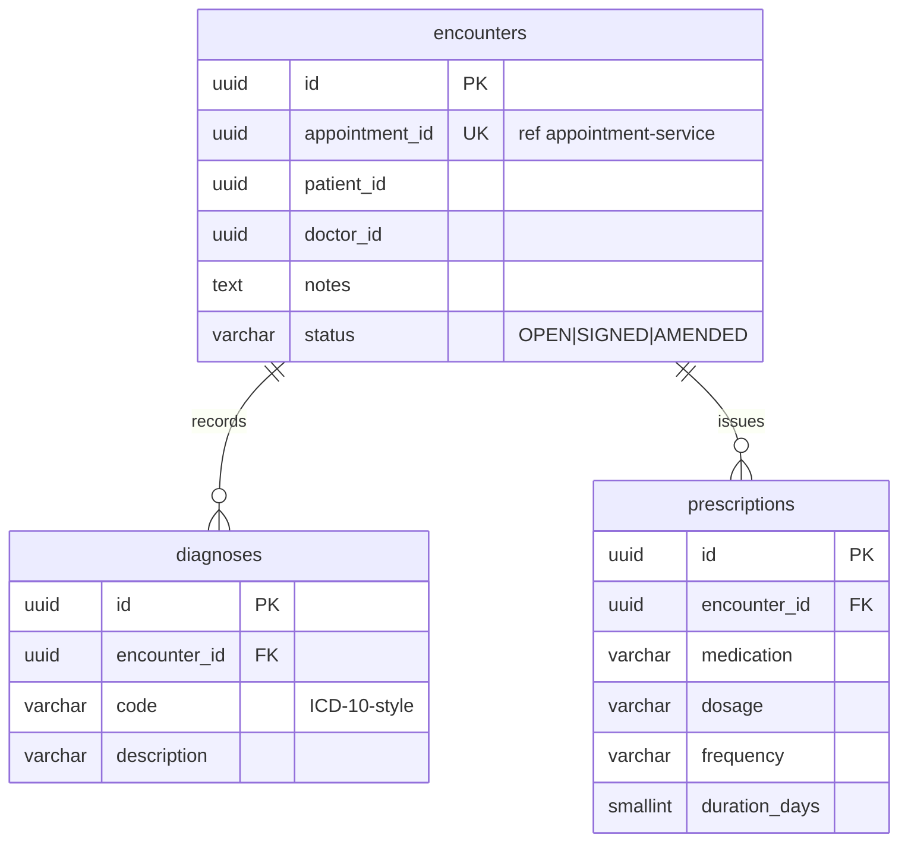
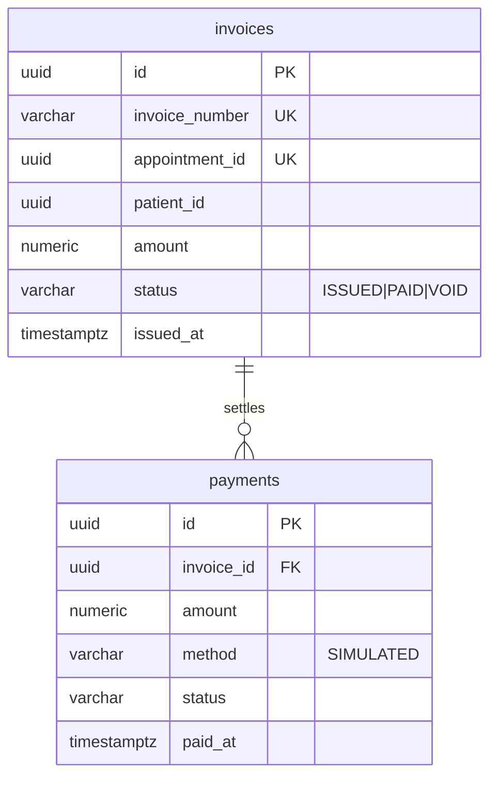
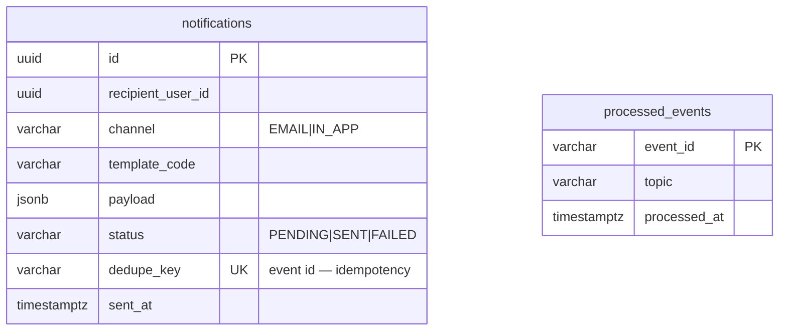

# Database Design

Database-per-service (ADR-003): locally one PostgreSQL container with **one logical database per service** (`infra/postgres/init/01-create-databases.sql`); in a real deployment these would be separate instances. Services never read another service's database — cross-context data travels via API or events, referenced by **UUID**.

Conventions: UUID PKs, `snake_case`, audit columns (`created_at`, `updated_at`, `created_by`, `updated_by`) on every table, Flyway migrations per service (`V1__init.sql`…), soft-delete via status fields where domain requires history.

## careconnect_identity

Note: `users` holds credentials only. Patient/doctor profile data lives in its owning service, linked by `user_id`. This avoids the common trap of identity-service becoming a "person service".

## careconnect_patient

*Design note:* address was originally sketched as `jsonb`; implemented as flat embedded
columns instead — no query-into-JSON requirement exists, `@Embeddable` is simpler than a JSON
mapper, and columns are constrainable. `jsonb` remains right when structure varies per row.

## careconnect_provider

## careconnect_appointment

`fee_snapshot` and an exclusion constraint on `(doctor_id, tstzrange(start_at, end_at))` prevent double-booking at the database level — the app checks first, the constraint guarantees.

## careconnect_medical_record

## careconnect_billing

## careconnect_notification

## Cross-service consistency
No foreign keys across services (impossible by construction). Where a service needs another context's data at read time it either calls the owning API (fresh, coupled) or keeps a snapshot taken from events (`fee_snapshot`, denormalized names in invoices). Rule of thumb used: **snapshot facts that must not change retroactively** (fees, amounts, names on invoices); **query live data that must be current** (slot availability).
