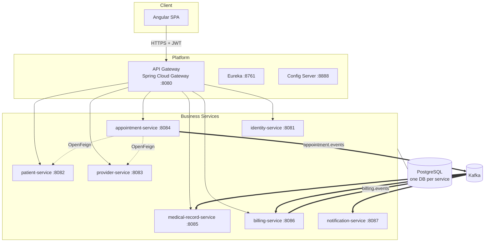
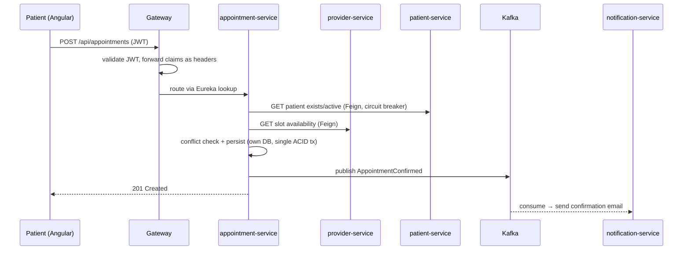

# High-Level Design

## 1. From domain to boundaries

The domain splits into bounded contexts along lines where language and ownership change. "Patient" means demographics to the front desk, a schedule participant to scheduling, and a chart owner to a doctor — a classic sign these belong to different contexts:

| Bounded context | Core concept | Owns |
|---|---|---|
| Identity & Access | credentials, roles | users, tokens |
| Patient | demographics | patient master data |
| Provider | doctors & availability | doctor profiles, schedules, fees |
| Scheduling | the appointment lifecycle | appointments, slots |
| Clinical Records | the encounter | encounters, diagnoses, prescriptions |
| Billing | money | invoices, payments |
| Notification | messaging | templates, delivery log |

Each context becomes exactly one service. We did **not** split further (e.g., separate "slot service") — a boundary must earn its network hop.

## 2. System diagram

Solid = client traffic, dotted = sync service-to-service (validation reads), thick = Kafka events (state propagation). Notification-service is not routed through the gateway: it has no client-facing API in v1.

## 3. Key decisions (each has an ADR)

| Decision | Why (short) | ADR |
|---|---|---|
| Microservices, 7 business services | Learning goal is distributed systems; boundaries follow contexts | [ADR-002](../adr/adr-002-microservices.md) |
| Database per service | Enforces ownership; no cross-service joins by construction | [ADR-003](../adr/adr-003-database-per-service.md) |
| Sync REST for queries, Kafka for facts | Reads need answers now; state changes propagate as events | [ADR-004](../adr/adr-004-sync-vs-async.md) |
| Stateless JWT validated at gateway | Horizontal scale, no session store; edge does coarse auth, services do fine-grained | [ADR-005](../adr/adr-005-jwt-auth.md) |
| Eureka + Config Server + Gateway | Standard Spring Cloud triad; each solves a concrete problem at this scale | [ADR-006](../adr/adr-006-spring-cloud-platform.md) |

## 4. Request flow example — booking an appointment

The booking transaction is local to appointment-service — no distributed transaction. Downstream effects (notification, later billing) are eventually consistent via events. If notification-service is down, booking still succeeds; Kafka retains the event.

## 5. What we consciously rejected

- **Modular monolith** — the honest default for this team size, rejected because the express goal is practicing distributed systems (trade-off recorded in ADR-002).
- **Saga orchestration / distributed transactions** — no workflow here spans services with compensation needs in v1; booking is a local transaction plus events. Documented as a future topic in interview notes.
- **CQRS with separate read models** — no read/write asymmetry that justifies it.
- **Microfrontends** — one Angular app, feature-module per context.
