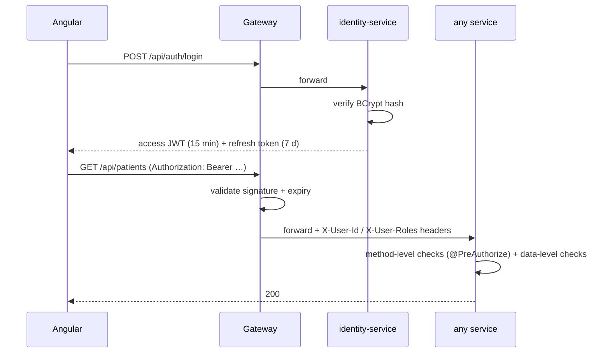

# Security & Authentication Flow

## Model
Stateless JWT (ADR-005). identity-service is the only issuer; the gateway is the only entry point and performs signature/expiry validation; services enforce fine-grained authorization from claims.

## Login & request flow

JWT claims: `sub` (userId), `roles`, `email`, `iat`, `exp`. Access tokens are short-lived and never stored server-side; refresh tokens are hashed in the identity DB and revocable (logout, admin action).

## Layered authorization
1. **Gateway** — authentication only (valid token or 401), plus per-IP rate limiting of the public auth endpoints. Public routes: login, register, doctor directory, waiting-room board.
2. **Service, method level** — role checks (`@PreAuthorize("hasRole('DOCTOR')")`).
3. **Service, data level** — ownership and *relationship* checks in application code: a PATIENT can read only their own record; a DOCTOR only patients they have treated. **Role checks alone are insufficient** — this is the layer juniors most often miss (IDOR).

### Why layer 3 needs naming twice

Two rules, because the second is the one that gets forgotten:

- **A caller-supplied id is never proof of identity.** Any path or body parameter naming a doctor or patient (`/appointments/doctor/{doctorId}`, `/queue/doctor/{doctorId}/call-next`) must be compared against the profile actually linked to the caller's account, resolved through the owning service. The JWT subject is an identity `userId`, which is a *different id space* from `patientId`/`doctorId` (ADR-004), so the comparison has to cross that boundary rather than assume the ids match.
- **Guard the list, not only the item.** It is easy to gate `GET /records/{id}` and forget `GET /records/patient/{patientId}`, which returns the same data in bulk. The bulk endpoint is the more valuable target. Both are gated on the treating relationship, checked per (patient, doctor) — treating one patient grants nothing for another.

### Trusting the gateway, verifiably

Services authorize from `X-User-Id` / `X-User-Roles`, which the gateway sets from validated token claims, overwriting anything inbound. That model holds only while the gateway is the sole ingress, so two things enforce it rather than assume it:

- **Network**: only the gateway and the SPA publish ports. Services talk to each other on the compose network; Postgres, Kafka, Eureka and Config bind to loopback.
- **Proof of origin**: the gateway attaches a shared secret (`X-Gateway-Auth`), and `GatewayTrustFilter` in `platform-starter` **strips** identity headers arriving without it. The request then proceeds as anonymous and meets the normal 401, rather than being believed. Stripping rather than rejecting keeps unauthenticated traffic (container health probes) working and degrades predictably.

Compared at constant time, and unset by default so tests and a bare `spring-boot:run` behave as before — with a startup warning, so an unprotected deployment is never silent. Trade-off vs. re-validating the JWT in every service is recorded in ADR-005.

### Public endpoints carry redacted payloads

The waiting-room board is unauthenticated on purpose — a lobby kiosk has no credentials — which makes its *payload* the security boundary. It receives a `BoardSnapshot`: token number, status, priority, given name, ETA. No surname, no patient id, and no presenting complaint.

Redaction happens on the server. An earlier version sent the full queue entry and let the board component display only the first name, which protects nothing: the response was one devtools tab away. Screens that genuinely need clinical detail (the doctor console) use the SSE stream only as a change notification and re-read from an authenticated endpoint, so PHI never travels on an unauthenticated channel.

## Angular side
Access token lives in memory only (Angular signal — gone on tab close, not readable via storage). The refresh token is in `localStorage` in v1 so a page reload can restore the session; that is an XSS trade-off, mitigated by rotation + replay detection (a stolen-and-replayed refresh token revokes the whole session family). The strictly-better upgrade is an HttpOnly cookie set by the gateway — documented as future hardening rather than pretended. HTTP interceptor attaches tokens and silently refreshes on 401; route guards mirror (but never replace) server-side checks.

## The chart access trail

Everything above decides **who may** read a record. None of it records **who did** —
and in clinical software that second question is the one that gets audited.

Every read of clinical data writes an append-only row to `record_access_log`: the acting
account (the JWT subject, not the doctor/patient id — the account is what you can hold
answerable), their role, the patient, the encounter if it was a single-record read, the
action, whether it was self-access, and the correlation id that ties it back to the
request across every service it touched.

Three properties are deliberate:

- **Fail-closed.** The log write shares the read's transaction. If the audit insert fails,
  the read fails and the caller gets an error instead of the chart. An access you cannot
  prove happened is an access that should not have been served. The honest cost: chart
  reads now depend on a write succeeding, so this service cannot serve records from a
  read-only replica. For this domain that is the right way to fail.
- **Denied reads are not logged as accesses.** A refused attempt disclosed nothing, and
  padding the trail with non-reads would make "who saw this chart" answer with people who
  did not. Denials are a security-monitoring concern and appear as 403s.
- **Not an AOP aspect.** An aspect silently covers whatever matches its pointcut and
  silently misses a read path added later. For an audit trail, having to remember the call
  is a feature: the call site is greppable and a reviewer can see it.

The patient can read their own trail (`/my-record-access`) — which is the point. A log
only the institution can see is an internal control; a log the *subject* can see is
accountability. Staff audit any patient's trail, and admins can ask the reverse question,
"what has this account been reading", which is what you need when an account is suspected
of browsing records it has no business in.

**Not yet done:** the table is append-only by construction (no setters, no update path,
nothing calls delete) but not by database permission. The proper lock is a DB role with
INSERT and SELECT and no UPDATE or DELETE on this table.

## Secrets

The repository ships working default secrets so the stack starts with no setup, which is only safe if it cannot survive contact with a real environment. `InsecureDefaultsGuard` (gateway and identity-service) refuses to start when the JWT or gateway secret is one of the values committed here, or when the JWT secret is under HS256's 256-bit minimum.

The escape hatch is **fail-closed**: `careconnect.security.allow-insecure-defaults` defaults to `false`, so an environment that has never heard of the setting gets the strict behaviour. `docker-compose.yml` opts local development in explicitly, which also documents the situation at the place a reader would look.

## Practices checklist
BCrypt (strength 12) · validation on every boundary DTO · no PII/tokens in logs · secrets via environment (never in git; `.env.example` documents shape) · CORS locked to the SPA origin at the gateway · per-IP rate limiting on the public `/api/auth/**` endpoints · security headers (CSP, nosniff, frame-options, referrer-policy) on the SPA · startup refusal on published default secrets.

## Honest limitations
Not HIPAA-certified; no field-level encryption at rest; no mTLS between services (trusted network assumed, would be mesh territory). Documented so the omission is a decision, not ignorance.

Specific and current:

- **No PHI access log.** The layers above decide who *may* read a chart. Nothing records who *did*, which is the control a real clinical system is judged on.
- **No per-account lockout.** Rate limiting is per client address, so it slows broad guessing but not a patient, targeted attack on one known email. The lockout belongs in identity-service next to the user record.
- **Rate limit state is per gateway instance** (in-memory token buckets). Correct for the single-gateway topology; two replicas would each grant the full budget. Shared state needs Redis, which is not worth a datastore at this scale.
- **CSP permits `'unsafe-inline'` for styles.** Angular injects component styles as inline `<style>` elements and Material sets inline custom properties, so a nonce-based style policy would break the UI. `script-src` has no such exemption, which is the directive that actually stops injected JS.
- **No HSTS**, deliberately: the nginx listener is plain HTTP behind whatever terminates TLS, and browsers ignore the header from an HTTP origin. It belongs on the terminator with the HTTP→HTTPS redirect.
