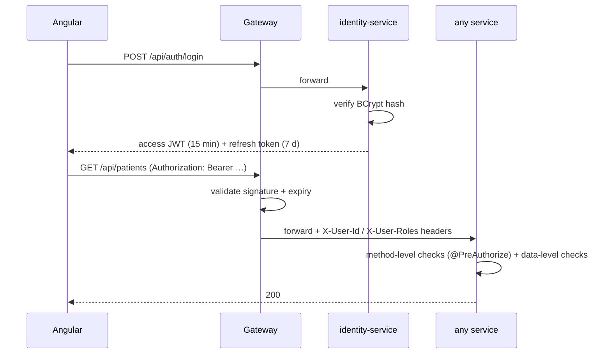

# Security & Authentication Flow

## Model
Stateless JWT (ADR-005). identity-service is the only issuer; the gateway is the only entry point and performs signature/expiry validation; services enforce fine-grained authorization from claims.

## Login & request flow

JWT claims: `sub` (userId), `roles`, `email`, `iat`, `exp`. Access tokens are short-lived and never stored server-side; refresh tokens are hashed in the identity DB and revocable (logout, admin action).

## Layered authorization
1. **Gateway** — authentication only (valid token or 401). Public routes: login, register, doctor directory.
2. **Service, method level** — role checks (`@PreAuthorize("hasRole('DOCTOR')")`).
3. **Service, data level** — ownership checks in application code: a PATIENT can read only their own record; a DOCTOR only encounters they treat. **Role checks alone are insufficient** — this is the layer juniors most often miss (IDOR).

Internal headers (`X-User-Id`, `X-User-Roles`) are stripped from inbound external requests at the gateway so they can't be spoofed. Trade-off vs. re-validating the JWT in every service is recorded in ADR-005.

## Angular side
Access token lives in memory only (Angular signal — gone on tab close, not readable via storage). The refresh token is in `localStorage` in v1 so a page reload can restore the session; that is an XSS trade-off, mitigated by rotation + replay detection (a stolen-and-replayed refresh token revokes the whole session family). The strictly-better upgrade is an HttpOnly cookie set by the gateway — documented as future hardening rather than pretended. HTTP interceptor attaches tokens and silently refreshes on 401; route guards mirror (but never replace) server-side checks.

## Practices checklist
BCrypt (strength 12) · validation on every boundary DTO · no PII/tokens in logs · secrets via environment (never in git; `.env.example` documents shape) · CORS locked to the SPA origin at the gateway · rate limiting on `/api/auth/**` at the gateway · OWASP dependency check in Phase 9 CI.

## Honest limitations
Not HIPAA-certified; no field-level encryption at rest; no mTLS between services (trusted network assumed, would be mesh territory). Documented so the omission is a decision, not ignorance.
