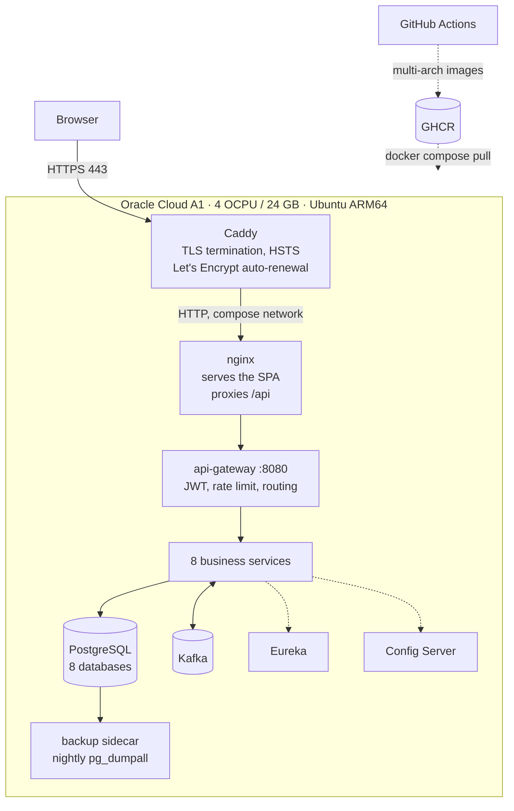

# Deploying CareConnect to a single VM

The whole stack — 11 services, Kafka, Postgres — on one machine, reachable over HTTPS at a real
hostname, redeployed automatically on every push to `main`.

Why one VM rather than a PaaS, and what was rejected:
[ADR-011](../adr/adr-011-deployment-topology.md).

## What the host has to be

Nothing here is provider-specific. Any of these works, and **only step 1 changes** between
them — steps 2 onward are identical because the deployment is a pair of Compose files, not a
vendor's console.

| Requirement | Why |
|---|---|
| **6–8 GB RAM** | Eleven JVMs, Kafka and Postgres budget to ~8 GB. 4 GB runs with the memory limits halved but leaves no headroom; **1 GB cannot work** — that is one Spring Boot service, not eleven |
| 2+ vCPU | Cold start is the load spike, not steady traffic |
| 40 GB disk | Images, two data volumes, backups |
| Ubuntu 22.04/24.04 | Any modern distro with Docker; the commands below assume apt |
| x86 **or** ARM | Images are published as multi-arch manifests, so both work with no change |
| Ports 80 + 443 reachable | Let's Encrypt validates over port 80 |

**Hosts that fit.** Oracle Cloud Always Free A1 (4 OCPU / 24 GB, genuinely free, but frequently
out of capacity), Hetzner CAX21 (~€6.50/mo, 8 GB ARM), Contabo, DigitalOcean 8 GB, or any AWS/
GCP/Azure instance of that size — note that all three cloud providers' *free* tiers are 1 GB and
therefore do not qualify; their generous offers are time-limited credits, not a free machine.

Skip to [step 2](#2-open-the-firewall--both-of-them) once you have a box with a public IP and
SSH access.

## 1. Provision the VM
<a id="provision"></a>

## Topology



Only Caddy binds a host port. Everything else is reachable solely on the compose network,
because the services' authorization trusts headers the gateway sets.

---

## 1. Provision the VM

Create an instance meeting the table above, with **Ubuntu 24.04** and a **static/reserved public
IP** so the DNS record never needs updating. That is the whole requirement; the rest of this
runbook does not care who provides it.

Provider-specific notes:

<details>
<summary><b>Oracle Cloud Always Free</b> — the only genuinely free option this size</summary>

Shape `VM.Standard.A1.Flex`, 4 OCPU / 24 GB, **ARM64 image**, 50 GB boot volume.

Oracle very often answers `Out of host capacity` for A1 in popular regions, and there is no
engineering fix. What works: trying each availability domain individually; dropping to
**1 OCPU / 6 GB**, which is frequently available and still fits after halving the memory limits
in `docker-compose.prod.yml`; retrying on a schedule; or upgrading to Pay As You Go, which
raises priority substantially and keeps the Always Free allowance free. Budget days, not
minutes. Signup also requires a card for identity verification (not charged), which is a common
failure point.
</details>

<details>
<summary><b>Hetzner / Contabo / DigitalOcean</b> — paid, ~€5-10/mo, no capacity lottery</summary>

Hetzner CAX21 (4 vCPU ARM, 8 GB, ~€6.50/mo) is the closest paid equivalent to the Oracle shape.
Create the server with Ubuntu 24.04 and your SSH key; the public IP is static by default.
Nothing else in this runbook changes — including the images, because they are published for
both architectures.
</details>

<details>
<summary><b>AWS / GCP / Azure</b></summary>

Their *free* tiers are 1 GB instances and cannot run this stack. Use a `t4g.large` /
`e2-standard-2` / `Standard_B2s`-class instance (8 GB) funded by signup credits, and be aware
the credits expire. Security groups replace the firewall step below; the instance's own iptables
is usually already open.
</details>

## 2. Open the firewall — both of them

This is where most first deployments stall, because the failure is a silent timeout with no log
anywhere. Some hosts need only the first part; Oracle needs both.

**a. The provider's firewall** — Oracle VCN Security List, AWS Security Group, Hetzner Cloud
Firewall, DigitalOcean Firewall. Add ingress for TCP **80** and **443** from `0.0.0.0/0`.

**b. The instance's own iptables.** Oracle's Ubuntu images ship with a netfilter ruleset that
drops everything except SSH, and opening only the provider firewall leaves the port shut while
looking identical from outside. Most other hosts ship with this open — check with
`sudo iptables -L INPUT -n` before assuming you need it:

```bash
sudo iptables -I INPUT 6 -m state --state NEW -p tcp --dport 80  -j ACCEPT
sudo iptables -I INPUT 6 -m state --state NEW -p tcp --dport 443 -j ACCEPT
sudo netfilter-persistent save
```

Verify from your laptop before going further — Let's Encrypt validation needs port 80 reachable,
and five failed attempts rate-limits the hostname for a week:

```bash
nc -zv <public-ip> 80 && nc -zv <public-ip> 443
```

## 3. Prepare the host

```bash
# Docker Engine + compose plugin
curl -fsSL https://get.docker.com | sudo sh
sudo usermod -aG docker "$USER" && newgrp docker

# Swap. Oracle images ship with none, and eleven JVMs starting at once is exactly
# the spike that turns a memory blip into an OOM-killer cascade through the
# dependency chain. It should sit unused in steady state.
sudo fallocate -l 4G /swapfile && sudo chmod 600 /swapfile
sudo mkswap /swapfile && sudo swapon /swapfile
echo '/swapfile none swap sw 0 0' | sudo tee -a /etc/fstab

# Unattended security updates
sudo apt-get update && sudo apt-get install -y unattended-upgrades fail2ban
sudo dpkg-reconfigure -plow unattended-upgrades
```

Harden SSH (`/etc/ssh/sshd_config`), then `sudo systemctl restart ssh`:

```
PasswordAuthentication no
PermitRootLogin no
```

## 4. Point DNS at it

Register a subdomain at [duckdns.org](https://www.duckdns.org) and set its IP to the VM's
reserved public address. Confirm it resolves before requesting a certificate:

```bash
dig +short careconnect.duckdns.org     # must return the VM's IP
```

DuckDNS is on the Public Suffix List, so Let's Encrypt issues for it over HTTP-01 with the stock
`caddy` image — no DNS plugin and no custom build.

## 5. Create the secrets

```bash
sudo mkdir -p /opt/careconnect && sudo chown "$USER" /opt/careconnect
cd /opt/careconnect

git clone https://github.com/<owner>/CareConnect.git repo   # or scp the files
./repo/infra/secrets/generate.sh /opt/careconnect/secrets
```

Four files are written, owner-readable only. **The administrator password is printed once** —
save it now; it is not recoverable, only resettable.

These are never environment variables and never in the repository. Docker mounts them at
`/run/secrets/`, and every service reads that directory through Spring's `configtree` import
(see any `application.yml`). The reasoning, and why it matters for a later move to Kubernetes,
is in [ADR-011](../adr/adr-011-deployment-topology.md#why-file-based-secrets-specifically).

## 6. Configure and start

```bash
cd /opt/careconnect
cp repo/docker-compose.prod.yml repo/docker-compose.edge.yml .
cp -r repo/infra .
cp repo/.env.example .env
```

Edit `.env` — only the deployment block at the bottom matters here:

```ini
CARECONNECT_REGISTRY=ghcr.io/<owner>
CARECONNECT_TAG=<commit-sha>
SECRETS_DIR=/opt/careconnect/secrets
CARECONNECT_DOMAIN=careconnect.duckdns.org
ACME_EMAIL=you@example.com
CORS_ALLOWED_ORIGINS=https://careconnect.duckdns.org
POSTGRES_USER=careconnect

# FIRST RUN ONLY — untrusted certificate, but no rate limit to burn while you
# find out that port 80 was closed after all. Remove it once HTTPS works.
ACME_CA=https://acme-staging-v02.api.letsencrypt.org/directory
```

> `CORS_ALLOWED_ORIGINS` is not optional and not cosmetic. Browsers send `Origin` on same-origin
> `POST`/`PUT`/`DELETE`, and the gateway rejects an unlisted origin with a bare 403 before
> routing. Get it wrong and **every read works while every write fails with an empty response
> body** — which reliably sends people debugging authentication instead.

Start it:

```bash
docker compose -f docker-compose.prod.yml -f docker-compose.edge.yml up -d
docker compose -f docker-compose.prod.yml -f docker-compose.edge.yml ps
```

First start takes **3–6 minutes**: config-server, then Eureka, then the gateway, then eight
services in parallel, each running Flyway and registering. `start_period` is set to 240s so
Docker does not kill anything that is merely still booting.

Once `curl -I https://careconnect.duckdns.org` returns a certificate (untrusted, from staging),
remove the `ACME_CA` line and restart just the edge to get a real one:

```bash
docker compose -f docker-compose.prod.yml -f docker-compose.edge.yml up -d caddy
```

## 7. Seed the demo data

The production file has **no seeder by default** — inventing patients in a real clinic's
database is a data integrity incident, not a convenience. For a portfolio deployment you want
it, so it is opt-in:

```bash
docker compose -f docker-compose.prod.yml -f docker-compose.edge.yml \
  --profile demo up seeder
```

Builds 5 doctors, 6 patients, appointments in every state, signed notes and invoices — all
through the public API. Idempotent: re-running it detects the marker account and stops.

## 8. Survive a reboot

`restart: unless-stopped` brings containers back if they crash, but a host reboot needs
something to run `compose up`. Make it explicit:

```bash
sudo tee /etc/systemd/system/careconnect.service >/dev/null <<'EOF'
[Unit]
Description=CareConnect
Requires=docker.service
After=docker.service network-online.target

[Service]
Type=oneshot
RemainAfterExit=yes
WorkingDirectory=/opt/careconnect
ExecStart=/usr/bin/docker compose -f docker-compose.prod.yml -f docker-compose.edge.yml up -d
ExecStop=/usr/bin/docker compose -f docker-compose.prod.yml -f docker-compose.edge.yml down
TimeoutStartSec=0

[Install]
WantedBy=multi-user.target
EOF

sudo systemctl enable --now careconnect
```

Then actually test it: `sudo reboot`, wait, and check the URL. An untested recovery path is a
guess.

## 9. Wire up continuous deployment

Push to `main` → CI runs → images publish → the VM rolls forward → the URL smoke-tests itself.

On the VM, create a deploy key and authorise it:

```bash
ssh-keygen -t ed25519 -f ~/deploy_key -N "" -C "github-actions"
cat ~/deploy_key.pub >> ~/.ssh/authorized_keys
cat ~/deploy_key            # → GitHub secret VM_SSH_KEY, then delete this file
ssh-keyscan -t ed25519 <public-ip>   # → GitHub secret VM_SSH_HOST_KEY
```

In the repository, create an Environment named `production`, then set:

| Kind | Name | Value |
|---|---|---|
| Secret | `VM_SSH_KEY` | the private key printed above |
| Secret | `VM_SSH_HOST_KEY` | the `ssh-keyscan` output |
| Variable | `VM_HOST` | the VM's public IP |
| Variable | `VM_USER` | `ubuntu` |
| Variable | `VM_APP_DIR` | `/opt/careconnect` |
| Variable | `CARECONNECT_DOMAIN` | `careconnect.duckdns.org` |

The host key is pinned rather than `StrictHostKeyChecking=no` — without it the pipeline would
hand a deploy key to whatever happens to answer on that address.

Make the GHCR packages **public** (package settings → change visibility) so the VM can pull
without credentials, and so anyone can reproduce the deployment.

The `deploy` job is skipped entirely when `VM_HOST` is unset, so forks and the pre-VM state of
this repository stay green rather than failing for a machine that never existed.

---

## Operating it

```bash
cd /opt/careconnect
C="docker compose -f docker-compose.prod.yml -f docker-compose.edge.yml"

$C ps                          # health of every service
$C logs -f --tail=100 api-gateway
docker stats --no-stream       # memory against the limits
free -h                        # swap should be ~untouched
```

**Backups** are written nightly by the `postgres-backup` sidecar to the `postgres-backups`
volume, 7 days retained. Verify one exists, and pull it off the machine — a backup that only
lives on the machine it protects is not a backup:

```bash
docker compose -f docker-compose.prod.yml exec postgres-backup ls -lh /backups
docker run --rm -v careconnect_postgres-backups:/b -v "$PWD":/out alpine \
  sh -c 'cp /b/$(ls -t /b | head -1) /out/'
```

**Restore:**

```bash
gunzip -c careconnect-<stamp>.sql.gz | \
  docker compose -f docker-compose.prod.yml exec -T postgres psql -U careconnect
```

**Rotating a secret:** write the new value, then restart the services that read it. Note that
rotating `JWT_SECRET` signs out every user, and rotating `POSTGRES_PASSWORD` requires an
`ALTER ROLE` inside Postgres first or the services cannot reconnect.

**Rollback:** re-run the CI workflow from an earlier commit on `main`. Deployments are tagged by
commit SHA, never `latest`, so the running version is always identifiable.

---

## When things are wrong

| Symptom | Cause |
|---|---|
| Port 80/443 times out; SSH is fine | The instance's iptables, not the VCN. See step 2b |
| Caddy logs an ACME challenge failure | Port 80 unreachable, or DNS not propagated. Fix, then use staging until it works |
| `too many certificates already issued` | Let's Encrypt rate limit; wait a week or use a new subdomain. Prevented by `ACME_CA` staging on first run |
| GETs work, every POST returns 403 with an empty body | `CORS_ALLOWED_ORIGINS` is missing the deployed origin |
| A service restart-loops with a secret-related failure | `InsecureDefaultsGuard` refusing a published default — the secret file is missing or empty, so the committed fallback applied |
| `exec format error` on start | An amd64-only image on ARM. Confirm with `docker buildx imagetools inspect <image>` |
| Waiting board stops updating after ~a minute | SSE being buffered or timed out by something in the path. `flush_interval -1` in the Caddyfile and the 20s heartbeat in `QueueBroadcaster` are what prevent this |
| Everything slows, then containers die | Disk full. `docker system df`; log rotation and Kafka retention are configured to prevent it |

General troubleshooting, including failures hit during development:
[troubleshooting.md](troubleshooting.md).
