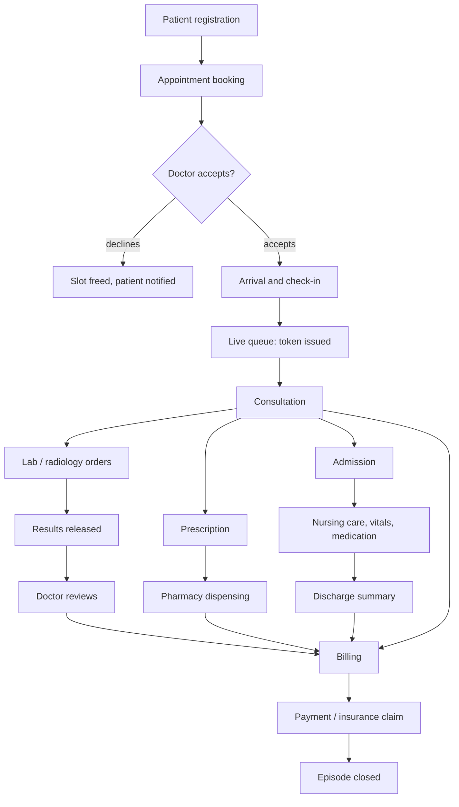
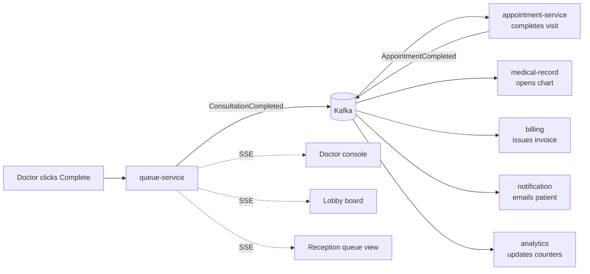

# 9 · Complete Workflows

## 9.1 The master clinical journey

## 9.2 Workflow: OPD visit, end to end
| # | Actor | Action | System reaction |
|---|---|---|---|
| 1 | Patient | Books a free slot | REQUESTED created, fee snapshotted, `AppointmentRequested` |
| 2 | Doctor | Accepts | CONFIRMED, `AppointmentConfirmed`, patient notified |
| 3 | Patient | Arrives | Reception checks in |
| 4 | Reception | Check-in | Token issued, queue entry WAITING, `PatientCheckedIn`, boards update |
| 5 | Doctor | Call next | Token CALLED, lobby board and patient device update within 1 s |
| 6 | Doctor | Start | IN_CONSULTATION, consultation clock starts |
| 7 | Doctor | Complete | `ConsultationCompleted` → appointment COMPLETED → `AppointmentCompleted` |
| 8 | *automatic* | — | Encounter opened · invoice issued at snapshotted fee · patient notified |
| 9 | Doctor | Documents and signs | Chart immutable; prescription queued to pharmacy |
| 10 | Pharmacy | Dispenses | Stock decrements, charge added to bill |
| 11 | Patient/Billing | Pays | Invoice PAID, receipt issued, `InvoicePaid` |

**Failure behaviour:** if billing or notification is down at step 8, the consultation
still completes; events wait in Kafka and the effects appear on recovery. If
patient-service or provider-service is down at step 1, booking fails fast with 503 — the
system refuses to book what it cannot validate.

## 9.3 Workflow: laboratory order to result *(Planned)*
| # | Actor | Action | System reaction |
|---|---|---|---|
| 1 | Doctor | Orders tests in the encounter | Order ORDERED, `LabRequested`, charge raised |
| 2 | Lab | Sees worklist by priority | STAT first, TAT countdown per order |
| 3 | Phlebotomist | Collects sample, scans barcode | SAMPLE_COLLECTED, `SampleCollected` |
| 4 | Technician | Scans into analyser | IN_PROCESS |
| 5 | Technician | Enters results | Out-of-range auto-flagged; critical → immediate doctor alert |
| 6 | Senior | Verifies | REPORTED → VERIFIED, PDF stored, `ReportUploaded` |
| 7 | *automatic* | — | Doctor notified · patient notified · result attached to encounter |

**Rule:** a result is never visible to the patient before verification. Critical values
alert the ordering doctor *before* verification, because delay costs lives.

## 9.4 Workflow: prescription to dispensing *(Planned)*
1. Doctor signs the encounter → `PrescriptionCreated` → pharmacy queue.
2. Pharmacist opens it; system runs interaction, allergy and duplicate checks.
3. Pharmacist selects batches (FEFO), records quantities, dispenses.
4. `MedicineDispensed` → inventory decrements → billing adds charge → patient notified.
5. Partial dispensing leaves the remainder pending with a reason.

## 9.5 Workflow: admission to discharge *(Planned)*
1. Doctor requests admission (provisional diagnosis, ward type, estimated stay).
2. Reception allocates a bed → `PatientAdmitted` → bed OCCUPIED, deposit collected.
3. Daily job accrues room charges; nursing records vitals and medication.
4. Doctor rounds daily; orders tests and medication as needed; all charges accumulate.
5. Doctor writes the discharge summary → `DischargeInitiated`.
6. Billing consolidates every charge; deposit adjusted; insurance split applied.
7. On settlement → `PatientDischarged` → bed released to CLEANING → summary available.

**Rule:** discharge cannot complete while the bill is unsettled unless an administrator
records an explicit waiver with reason.

## 9.6 Workflow: emergency *(Planned)*
1. Patient arrives; triage nurse assigns a level before registration completes.
2. A temporary identity is created if the patient is unidentified.
3. Triage level dictates queue priority — Immediate bypasses the queue entirely.
4. Care proceeds; identity is merged with the permanent record when known.
5. Disposition: discharge, admission, or transfer — each with its own downstream flow.

## 9.7 Real-time synchronisation
One action, many dashboards. Example — doctor completes a consultation:

| Screen | How it learns | Latency |
|---|---|---|
| Doctor console | SSE push | < 1 s |
| Waiting-room board | SSE push | < 1 s |
| Patient's phone | Poll (10 s) — resilient on mobile networks | ≤ 10 s |
| Reception queue | SSE push | < 1 s |
| Doctor's chart list | Event-driven creation, refresh on view | ~1–2 s |
| Patient invoices | Event-driven creation, refresh on view | ~1–2 s |
| Admin analytics | Metrics counters + query on load | seconds |

**Design choice:** SSE for screens that must react instantly (one-way, survives proxies,
auto-reconnects); polling for personal devices (resilient to network drops); events for
cross-service state (durable, replayable).

---

# 10 · Business Rules

## 10.1 Scheduling
| ID | Rule |
|---|---|
| BR-APT-1 | A doctor cannot hold two overlapping appointments — enforced by a database exclusion constraint, not application logic |
| BR-APT-2 | Bookings are only possible inside published availability, minus schedule exceptions |
| BR-APT-3 | Slots in the past are never offered |
| BR-APT-4 | Cancelling frees the slot instantly for rebooking |
| BR-APT-5 | Patients may cancel up to 2 hours before start (configurable); staff may cancel any time |
| BR-APT-6 | The consultation fee is frozen at booking; later tariff changes never alter an existing appointment |
| BR-APT-7 | Only the doctor who owns the appointment (or staff acting for them) may accept or decline it |
| BR-APT-8 | A completed or cancelled appointment is terminal — no further transitions |

## 10.2 Queue
| ID | Rule |
|---|---|
| BR-QUE-1 | Tokens are sequential and gap-free per doctor per day |
| BR-QUE-2 | Priority reorders groups; within a priority, arrival order is preserved |
| BR-QUE-3 | Three unanswered calls skip the token; the patient may be requeued at current time |
| BR-QUE-4 | Wait estimates use the median of the doctor's last 20 consultations (min 3 samples), else the clinic default |
| BR-QUE-5 | A patient who leaves is recorded as LEFT — walk-away rate is a quality metric, not a deletion |
| BR-QUE-6 | Completing a consultation is the only trigger for the downstream clinical/financial chain |

## 10.3 Clinical records
| ID | Rule |
|---|---|
| BR-EMR-1 | An encounter exists only as a consequence of a completed consultation |
| BR-EMR-2 | Signing requires clinical notes to be present |
| BR-EMR-3 | A signed record is immutable; corrections are amendments preserving prior text and reason |
| BR-EMR-4 | Only the treating doctor may write; the owning patient and administrative staff may read |
| BR-EMR-5 | Clinical content is never exposed to reception, billing or pharmacy beyond what their task requires |
| BR-EMR-6 | Read access to clinical records is logged |

## 10.4 Laboratory & radiology *(Planned)*
| ID | Rule |
|---|---|
| BR-LAB-1 | A sample is bound to a patient only by barcode scan — never by typing a name |
| BR-LAB-2 | Results are released to patients only after verification by an authorised senior |
| BR-LAB-3 | Critical values alert the ordering doctor immediately, before verification |
| BR-LAB-4 | A rejected sample requires a documented reason and triggers re-collection |
| BR-RAD-1 | Ionising studies require a pregnancy/contrast safety check to be recorded |

## 10.5 Pharmacy & inventory *(Planned)*
| ID | Rule |
|---|---|
| BR-PHR-1 | Dispensing requires a signed prescription, except explicit OTC counter sales |
| BR-PHR-2 | Batches are consumed earliest-expiry-first (FEFO) |
| BR-PHR-3 | Expired stock cannot be dispensed and is quarantined automatically |
| BR-PHR-4 | Substitutions require a recorded pharmacist reason |
| BR-PHR-5 | Controlled substances require register entries with dual attribution |
| BR-INV-1 | Stock can never go negative; a dispense that would breach this is rejected |
| BR-INV-2 | Goods receipt must reference a purchase order |

## 10.6 Admission & nursing *(Planned)*
| ID | Rule |
|---|---|
| BR-IPD-1 | A bed holds at most one active admission |
| BR-IPD-2 | Room charges accrue per calendar day from admission to discharge |
| BR-IPD-3 | Bed transfers preserve full movement history |
| BR-IPD-4 | Discharge requires a signed summary and a settled (or explicitly waived) bill |
| BR-IPD-5 | A discharged bed enters CLEANING before becoming available |
| BR-NUR-1 | Medication administration is recorded against the ordered schedule with time and nurse |
| BR-NUR-2 | Missed or refused doses require a reason |
| BR-NUR-3 | Nurses see only their assigned ward and shift |

## 10.7 Billing & insurance
| ID | Rule |
|---|---|
| BR-BIL-1 | Every completed clinical service produces a charge automatically — no manual step can be skipped |
| BR-BIL-2 | Money is exact decimal; never floating point |
| BR-BIL-3 | A payment reference is unique; a repeated submit is rejected, never charged twice |
| BR-BIL-4 | A paid invoice is never voided; corrections are refunds with approval |
| BR-BIL-5 | Discounts beyond a user's authority limit require approval and a reason |
| BR-BIL-6 | Insurance split is computed from plan rules; the patient pays only the co-pay portion |
| BR-BIL-7 | Amounts are snapshotted at the time of service; later tariff changes never rewrite history |

## 10.8 Platform-wide
| ID | Rule |
|---|---|
| BR-SYS-1 | Records are deactivated, never deleted |
| BR-SYS-2 | Every mutation is attributable to a user and a timestamp |
| BR-SYS-3 | Data is scoped to a branch; cross-branch access requires Super Admin |
| BR-SYS-4 | A failure in a non-clinical service never blocks clinical care |
| BR-SYS-5 | Every domain event is delivered at least once and processed exactly once |
