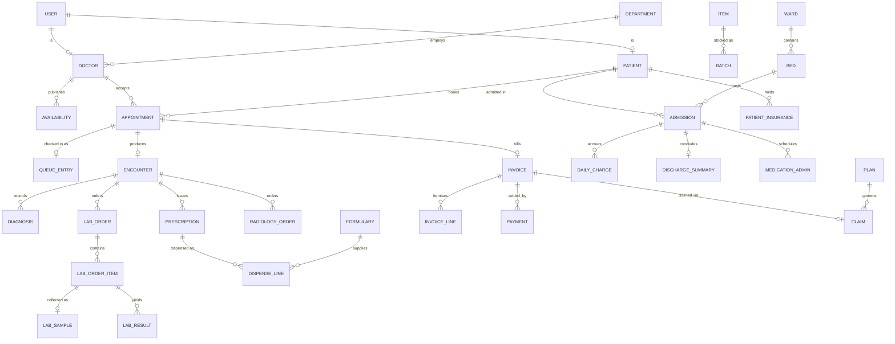

# 15 · Database Design

## 15.1 Principles
- **Database per service.** No service reads another's tables; cross-context references
  are UUIDs resolved through APIs or carried in events.
- **UUID primary keys** — safe to generate anywhere, never leak volume.
- **Exact decimals for money** (`NUMERIC(12,2)`), never floating point.
- **Audit columns everywhere**: `created_at`, `updated_at`, `created_by`, `updated_by`.
- **Soft state, not deletion**: status columns; clinical and financial rows are permanent.
- **Constraints in the database**, not only in code — exclusion constraints, checks,
  unique keys and foreign keys are the last line of defence.
- **Versioned migrations** (Flyway) with Hibernate in `validate` mode.
- **Normalised to 3NF**, with deliberate denormalised snapshots where history must not
  change (fees on appointments, names on invoices).

## 15.2 Schemas by service

### identity (`careconnect_identity`) — Built
```
users(id PK, email UK, password_hash, status, branch_id, created_at, updated_at)
roles(id PK, name UK)
user_roles(user_id FK, role_id FK, PK(user_id, role_id))
refresh_tokens(id PK, user_id FK, token_hash UK, expires_at, revoked, created_at)
  IX (user_id)
```

### patient (`careconnect_patient`) — Built
```
patients(id PK, user_id UK NULL, patient_number UK, first_name, last_name,
         date_of_birth, gender, phone, email, address_line1, address_line2, city,
         state, postal_code, emergency_contact_name, emergency_contact_phone,
         status, branch_id, audit…)
  IX lower(last_name), IX phone, IX (branch_id, status)
patient_allergies(id PK, patient_id FK, allergen, reaction, severity, recorded_by)   -- Planned
patient_insurance(id PK, patient_id FK, payer_id, policy_no, valid_from, valid_to,
                  sum_insured, status)                                               -- Planned
outbox_events(id PK, topic, event_type, aggregate_id, payload, created_at,
              published_at NULL, attempts, last_error)
  IX (created_at) WHERE published_at IS NULL
```

### provider (`careconnect_provider`) — Built
```
departments(id PK, name UK, branch_id, created_at)
doctors(id PK, user_id UK, first_name, last_name, specialty, department_id FK,
        consultation_fee NUMERIC(10,2), email, phone, status,
        verification, qualification, registration_no, experience_years, bio,
        rejection_reason, reviewed_at, branch_id, audit…)
  IX lower(specialty), IX (verification), IX (branch_id, status)
availability_slots(id PK, doctor_id FK, day_of_week 1-7, start_time, end_time,
                   slot_minutes, CHECK start<end)
  IX (doctor_id, day_of_week)
schedule_exceptions(id PK, doctor_id FK, exception_date, reason, UK(doctor_id, date))
```

### appointment (`careconnect_appointment`) — Built
```
appointments(id PK, patient_id, doctor_id, start_at, end_at, status, reason,
             fee_snapshot NUMERIC(10,2), patient_name, doctor_name, branch_id, audit…)
  CHECK start_at < end_at
  EXCLUDE USING gist (doctor_id WITH =, tstzrange(start_at,end_at) WITH &&)
         WHERE (status IN ('REQUESTED','CONFIRMED'))          -- double-booking impossible
  IX (patient_id, start_at DESC), IX (doctor_id, start_at)
appointment_status_history(id PK, appointment_id FK, from_status, to_status,
                           changed_by, changed_at)
processed_events(event_id PK, topic, processed_at)
outbox_events(…)
```

### queue (`careconnect_queue`) — Built
```
queue_entries(id PK, appointment_id UK NULL, patient_id, doctor_id, patient_name,
              doctor_name, token_number, queue_date, priority, status, complaint,
              checked_in_at, called_at, started_at, completed_at, consultation_secs,
              call_attempts, branch_id, audit…)
  UK (doctor_id, queue_date, token_number)
  IX (doctor_id, queue_date, status), IX (patient_id, queue_date DESC)
token_counters(doctor_id, queue_date, last_number, PK(doctor_id, queue_date))
```

### medical_record (`careconnect_medical_record`) — Built
```
encounters(id PK, appointment_id UK, patient_id, doctor_id, patient_name, doctor_name,
           occurred_at, chief_complaint, notes TEXT, status, branch_id, audit…)
  IX (patient_id, occurred_at DESC), IX (doctor_id, occurred_at DESC)
diagnoses(id PK, encounter_id FK, code, description, created_at)
prescriptions(id PK, encounter_id FK, medication, dosage, frequency,
              duration_days CHECK 1-365, instructions, created_at)
encounter_amendments(id PK, encounter_id FK, previous_note, reason, amended_by, amended_at)
vitals(id PK, encounter_id FK NULL, admission_id NULL, temperature, pulse, systolic,
       diastolic, respiration, spo2, pain_score, recorded_by, recorded_at)   -- Planned
processed_events(event_id PK, topic, processed_at)
```

### laboratory (`careconnect_laboratory`) — Planned
```
test_catalogue(id PK, code UK, name, specimen_type, department, price NUMERIC(10,2),
               tat_minutes, active)
test_analytes(id PK, test_id FK, name, unit, ref_low, ref_high, critical_low, critical_high)
lab_orders(id PK, encounter_id, patient_id, doctor_id, patient_name, priority,
           status, clinical_indication, ordered_at, branch_id, audit…)
  IX (status, priority, ordered_at), IX (patient_id)
lab_order_items(id PK, order_id FK, test_id, test_name, price_snapshot, status)
lab_samples(id PK, order_item_id FK, accession_no UK, specimen_type, collected_by,
            collected_at, rejected_reason NULL)
lab_results(id PK, order_item_id FK, analyte_id, value, unit, flag,     -- H/L/CRIT
            entered_by, entered_at, verified_by NULL, verified_at NULL)
lab_reports(id PK, order_id FK, file_key, released_at, released_by)
```

### radiology (`careconnect_radiology`) — Planned
```
modalities(id PK, code UK, name, prep_instructions, price, slot_minutes)
radiology_orders(id PK, encounter_id, patient_id, doctor_id, modality_id, priority,
                 status, safety_checklist JSONB, scheduled_at, performed_at, audit…)
radiology_reports(id PK, order_id FK, findings TEXT, impression TEXT, recommendation,
                  reported_by, reported_at, file_key)
```

### pharmacy (`careconnect_pharmacy`) — Planned
```
formulary(id PK, code UK, generic_name, brand_name, strength, form, schedule_class,
          unit_price NUMERIC(10,2), active)
  IX lower(generic_name), IX lower(brand_name)
dispense_orders(id PK, prescription_id, encounter_id, patient_id, patient_name,
                status, dispensed_by, dispensed_at, branch_id, audit…)
dispense_lines(id PK, dispense_order_id FK, formulary_id, batch_id, quantity,
               unit_price_snapshot, substitution_reason NULL)
counter_sales(id PK, patient_id NULL, sold_by, total NUMERIC(12,2), sold_at)
controlled_register(id PK, formulary_id, dispense_line_id, quantity, balance,
                    witnessed_by, recorded_at)
```

### inventory (`careconnect_inventory`) — Planned
```
items(id PK, code UK, name, category, uom, reorder_level, active)
batches(id PK, item_id FK, batch_no, expiry_date, quantity, location_id,
        cost_price, UK(item_id, batch_no, location_id))
  IX (expiry_date), IX (item_id, location_id)
locations(id PK, name, type)                        -- main store, ward, OT, pharmacy
stock_movements(id PK, item_id, batch_id, from_location NULL, to_location NULL,
                quantity, movement_type, reference_id, moved_by, moved_at)
suppliers(id PK, name, contact, lead_time_days, active)
purchase_orders(id PK, supplier_id FK, status, ordered_at, expected_at, total)
purchase_order_lines(id PK, po_id FK, item_id, quantity, rate)
goods_receipts(id PK, po_id FK, received_by, received_at)
```

### admission (`careconnect_admission`) — Planned
```
wards(id PK, name, type, floor, branch_id)
beds(id PK, ward_id FK, bed_number, tariff_per_day NUMERIC(10,2), status,
     UK(ward_id, bed_number))
  IX (ward_id, status)
admissions(id PK, patient_id, patient_name, admitting_doctor_id, bed_id FK,
           provisional_diagnosis, admitted_at, expected_days, status,
           discharged_at NULL, branch_id, audit…)
  IX (status), IX (patient_id, admitted_at DESC)
bed_movements(id PK, admission_id FK, from_bed_id, to_bed_id, reason, moved_at, moved_by)
daily_charges(id PK, admission_id FK, charge_date, bed_tariff, UK(admission_id, charge_date))
discharge_summaries(id PK, admission_id UK, final_diagnosis, course TEXT, procedures TEXT,
                    discharge_medication TEXT, follow_up, written_by, written_at, file_key)
medication_administration(id PK, admission_id FK, prescription_id, scheduled_at,
                          administered_at NULL, status, reason NULL, nurse_id)
  IX (admission_id, scheduled_at)
```

### billing (`careconnect_billing`) — Built (consolidation Planned)
```
invoices(id PK, invoice_number UK, appointment_id UK NULL, admission_id NULL,
         patient_id, patient_name, doctor_name, amount NUMERIC(10,2), status,
         issued_at, paid_at, voided_reason, branch_id, audit…)
  IX (patient_id, issued_at DESC), IX (status)
invoice_lines(id PK, invoice_id FK, department, description, quantity, unit_price,
              tax_rate, line_total, source_service, source_id)          -- Planned
payments(id PK, invoice_id FK, amount, method, reference UK, paid_at, recorded_by)
  IX (invoice_id)
discounts(id PK, invoice_id FK, amount, reason, approved_by, applied_at)   -- Planned
refunds(id PK, invoice_id FK, amount, reason, requested_by, approved_by, status) -- Planned
```

### insurance (`careconnect_insurance`) — Planned
```
payers(id PK, name, code UK, active)
plans(id PK, payer_id FK, name, coverage_rules JSONB, copay_percent, exclusions JSONB)
pre_authorisations(id PK, patient_id, plan_id, procedure_code, requested_amount,
                   status, approved_amount, requested_at, decided_at)
claims(id PK, invoice_id, patient_id, plan_id, claim_number UK, claimed_amount,
       approved_amount, status, submitted_at, settled_at)
claim_documents(id PK, claim_id FK, file_key, document_type)
```

### notification (`careconnect_notification`) — Built
```
notifications(id PK, recipient_ref, channel, template_code, subject, body, status,
              source_event_id UK, created_at, sent_at)
processed_events(event_id PK, topic, processed_at)
```

### audit (`careconnect_audit`) — Planned
```
audit_entries(id PK, actor_id, actor_role, action, entity_type, entity_id,
              before JSONB, after JSONB, ip, correlation_id, branch_id, occurred_at)
  IX (entity_type, entity_id), IX (actor_id, occurred_at DESC), IX (occurred_at)
  PARTITION BY RANGE (occurred_at)                  -- monthly partitions
access_logs(id PK, actor_id, patient_id, resource, correlation_id, accessed_at)
```

## 15.3 Indexing strategy
Every foreign key is indexed. Composite indexes follow the query, not the table
(`(doctor_id, queue_date, status)` serves the live-queue query exactly). Partial indexes
where the hot set is small (`WHERE published_at IS NULL` on outbox). Functional indexes
for case-insensitive search (`lower(last_name)`). Time-series tables (audit, vitals,
stock movements) are partitioned monthly.

---

# 16 · Entity Relationship Diagram



**Cross-service references** (dotted in reality, no FK): `appointment.patient_id` →
patient service; `encounter.appointment_id` → appointment service; `invoice.appointment_id`
→ appointment service. Referential integrity across services is maintained by events and
by the rule that records are never deleted.
