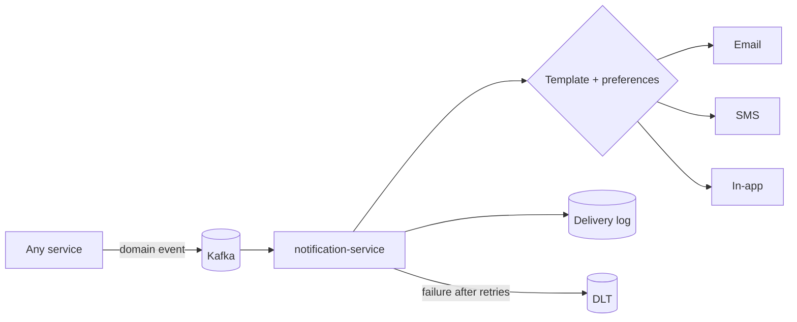

# 18 · Microservices

## 18.1 Service map
| Service | Port | Owns | Status |
|---|---|---|---|
| config-server | 8888 | Centralised configuration | Built |
| discovery-server (Eureka) | 8761 | Service registry | Built |
| api-gateway | 8080 | Edge routing, JWT validation, CORS, correlation ids | Built |
| identity-service | 8081 | Users, roles, tokens, staff accounts | Built |
| patient-service | 8082 | Patient master, MRN, allergies, insurance links | Built |
| provider-service | 8083 | Doctors, credentials, availability, departments | Built |
| appointment-service | 8084 | Scheduling, lifecycle, fee snapshots | Built |
| medical-record-service | 8085 | Encounters, diagnoses, prescriptions, vitals | Built |
| billing-service | 8086 | Invoices, payments, discounts, refunds | Built |
| notification-service | 8087 | Email/SMS/in-app delivery | Built |
| queue-service | 8088 | Live OPD queue, tokens, wait prediction | Built |
| laboratory-service | 8089 | Test catalogue, orders, samples, results | Planned |
| radiology-service | 8090 | Modalities, imaging orders, reports | Planned |
| pharmacy-service | 8091 | Formulary, dispensing, counter sales | Planned |
| inventory-service | 8092 | Items, batches, purchase orders, stock | Planned |
| admission-service | 8093 | Wards, beds, admissions, discharge, nursing | Planned |
| insurance-service | 8094 | Payers, plans, pre-auth, claims | Planned |
| analytics-service | 8095 | Aggregations, reports, dashboards | Planned |
| audit-service | 8096 | Immutable audit and access logs | Planned |
| file-service | 8097 | Object storage gateway, pre-signed URLs | Planned |

## 18.2 Boundary rationale
Services follow **bounded contexts**, not tables. A boundary is justified when the
language changes, ownership changes, or failure must be isolated:

- **Laboratory and radiology are separate** — different workflows (specimen vs modality
  scheduling), different professionals, different equipment constraints.
- **Pharmacy and inventory are separate** — pharmacy is a clinical safety workflow;
  inventory is a supply-chain ledger also serving wards, OT and stores.
- **Admission includes nursing and beds** — nursing tasks exist only within an admission;
  splitting them would create a chatty, transactionally awkward boundary.
- **Audit is separate and write-only from the outside** — its integrity depends on nobody
  else owning it.

## 18.3 Communication rules
1. **Queries are synchronous** (OpenFeign + circuit breaker), maximum chain depth 1.
2. **State changes travel as events** — a service never commands another synchronously.
3. **Events are facts, past tense, self-contained** — consumers never call back for context.
4. **Every consumer is idempotent** via a processed-event ledger.
5. **Every producer writes to an outbox** inside the business transaction.

---

# 19 · Kafka Events

## 19.1 Topic catalogue
| Topic | Partitions | Key | Producer | Consumers |
|---|---|---|---|---|
| `patient.events` | 3 | patientId | patient | notification, analytics, audit |
> Topics for services marked *Planned* above are specified here but do not exist at
> runtime. Live today: `patient.events`, `appointment.events`, `queue.events`,
> `billing.events`. `lab.events` was live and was removed with laboratory-service
> ([ADR-010](../adr/adr-010-remove-laboratory-service.md)).

| `appointment.events` | 3 | appointmentId | appointment | queue, medical-record, billing, notification, analytics |
| `queue.events` | 3 | queueEntryId | queue | appointment, analytics, notification |
| `clinical.events` | 3 | encounterId | medical-record | pharmacy, billing, analytics, audit |
| `lab.events` | 3 | orderId | laboratory | medical-record, billing, notification, analytics |
| `radiology.events` | 3 | orderId | radiology | medical-record, billing, notification |
| `pharmacy.events` | 3 | dispenseId | pharmacy | inventory, billing, notification, analytics |
| `inventory.events` | 3 | itemId | inventory | notification (alerts), analytics |
| `admission.events` | 3 | admissionId | admission | billing, notification, analytics, medical-record |
| `billing.events` | 3 | invoiceId | billing | insurance, notification, analytics |
| `insurance.events` | 3 | claimId | insurance | billing, notification |
| `audit.events` | 6 | entityId | all services | audit |
| `<topic>.DLT` | 1 | — | error handler | operations (monitored) |

## 19.2 Event catalogue
| Event | Payload (self-contained) | Triggers |
|---|---|---|
| `PatientRegistered` | patientId, MRN, name, email | Welcome notification, analytics |
| `AppointmentRequested` | appointmentId, patient, doctor, start, fee | Doctor inbox, notification |
| `AppointmentConfirmed` | + confirmedBy | Patient notification, reminders scheduled |
| `AppointmentCancelled` | + reason, cancelledBy | Slot freed, notification |
| `AppointmentCompleted` | + duration | **Encounter opened, invoice issued, notification** |
| `AppointmentNoShow` | appointmentId, patient, doctor | Analytics, follow-up policy |
| `PatientCheckedIn` | queueEntryId, token, doctor, priority | Boards update, analytics |
| `PatientCalled` | + attempt | Board + patient device |
| `ConsultationStarted` | + startedAt | Wait metrics |
| `ConsultationCompleted` | + durationSeconds, appointmentId | **Appointment completion cascade** |
| `PatientLeft` | queueEntryId, waitedMinutes | Walk-away metric |
| `PrescriptionCreated` | encounterId, patient, items[] | Pharmacy queue |
| `LabRequested` | orderId, encounter, patient, tests[], priority | Lab worklist, billing charge |
| `SampleCollected` | orderId, accession, collectedBy | TAT clock starts |
| `LabResultCritical` | orderId, analyte, value, doctorId | **Immediate doctor alert** |
| `ReportUploaded` | orderId, fileKey, verifiedBy | Doctor + patient notification, EMR attach |
| `MedicineDispensed` | dispenseId, items[], patient | Inventory decrement, billing charge |
| `StockLow` / `StockExpiring` | itemId, batch, level/date | Pharmacy + admin alerts |
| `PatientAdmitted` | admissionId, patient, bed, ward, doctor | Billing accrual, ward board |
| `BedTransferred` | admissionId, fromBed, toBed | Board update |
| `VitalsRecorded` | admissionId, values, abnormalFlags | Doctor alert if abnormal |
| `PatientDischarged` | admissionId, summaryKey, LOS | Bed release, final bill, notification |
| `InvoiceIssued` | invoiceId, patient, amount, lines[] | Patient notification, insurance eligibility |
| `InvoicePaid` | + method, reference | Receipt, analytics |
| `ClaimSubmitted` / `ClaimSettled` | claimId, invoice, amounts | Billing reconciliation |

## 19.3 Reliability model
**Producing.** Events are written to `outbox_events` inside the business transaction; a
relay polls every second, publishes synchronously, marks rows published, and uses
`SELECT … FOR UPDATE SKIP LOCKED` so multiple instances never double-publish. A
`careconnect.outbox.pending` gauge is the alerting signal.

**Consuming.** At-least-once delivery is assumed. Each consumer records `eventId` in
`processed_events` **in the same transaction as its side effect**; redelivery becomes a
no-op. Ordering is guaranteed per key (aggregate id), which is the only ordering needed.

**Failure.** Three retries with backoff, then the record moves to `<topic>.DLT` with
failure headers; the listener continues so one poison message never blocks a partition.
DLT depth is monitored and replay is a deliberate operational act.

**Schema evolution.** Additive changes only; breaking changes bump `version` in the
envelope and are documented before deployment. Consumers ignore unknown event types —
subscribing to a topic is not subscribing to a curated feed.

---

# 20 · Notification Flow

## 20.1 Pipeline

## 20.2 Catalogue
| Trigger | Recipient | Channels | Timing |
|---|---|---|---|
| PatientRegistered | Patient | Email, in-app | Immediate |
| AppointmentRequested | Patient, Doctor | In-app; email to patient | Immediate |
| AppointmentConfirmed / Cancelled | Patient | Email, SMS, in-app | Immediate |
| Appointment reminder | Patient | SMS, in-app | 24 h and 2 h before *(Planned)* |
| PatientCalled | Patient | In-app push | Immediate |
| LabResultCritical | Ordering doctor | SMS + in-app, escalating | Immediate, retried until acknowledged |
| ReportUploaded | Patient, Doctor | Email + in-app | On verification |
| MedicineDispensed | Patient | In-app | Immediate |
| StockLow / StockExpiring | Pharmacist, Admin | In-app, daily email digest | Daily 08:00 |
| PatientAdmitted / Discharged | Patient, next of kin | SMS, email | Immediate |
| InvoiceIssued / InvoicePaid | Patient | Email + in-app | Immediate |
| ClaimSettled | Patient, Billing | Email | Immediate |

## 20.3 Rules
Notifications never block a business flow. One event yields exactly one notification
(idempotency on `eventId`). Clinical content is never sent over SMS — messages say a
report is ready, never what it says. Per-user channel preferences apply, except for
safety-critical alerts, which always deliver. Delivery outcome is recorded and visible to
operations.
