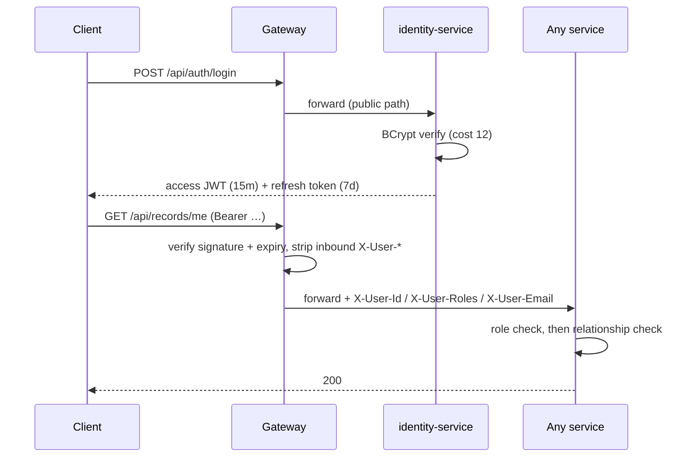

# 21 · Authentication

## 21.1 Model
Stateless JWT issued by identity-service, validated at the gateway, forwarded to services
as trusted headers. Access tokens are short-lived (15 min) and never stored server-side;
refresh tokens (7 days) are stored **only as SHA-256 hashes** and are revocable.

**Claims:** `sub` (userId), `email`, `roles[]`, `iat`, `exp`. HS256/384 shared secret
today; RS256 with a published JWKS is the upgrade path when third parties must verify.

**Rotation with replay detection:** each refresh consumes the presented token and issues
a new pair. A *replayed* token indicates theft, so every session for that user is
revoked. The client must therefore refresh **single-flight** — concurrent 401s share one
refresh — or it will trip the defence itself (a real bug we hit and fixed).

**Registration policy:** only PATIENT and DOCTOR may self-register; a self-registered
doctor is an applicant until verified. STAFF, ADMIN, and all other roles are provisioned
by an administrator.

**Planned:** self-service password reset by single-use link; optional TOTP 2FA for staff;
device/session list with remote sign-out; OAuth2/OIDC federation for hospital SSO.

# 22 · Authorization

Three layers, deliberately separated:

| Layer | Question | Mechanism |
|---|---|---|
| Gateway | Is this a valid session? | JWT validation; 401 otherwise. **No role logic here** |
| Method | Does this role perform this operation? | `@PreAuthorize("hasAnyRole(...)")` |
| Row | Does this user stand in the right relationship to this record? | Service-layer checks |

**Why the third layer matters:** `hasRole('DOCTOR')` says the caller is *a* doctor, not
*the treating* doctor. Clinical records, appointments and invoices all verify the
relationship — treating doctor, owning patient, assigned nurse — before returning or
mutating a row. Patient-facing endpoints are `/me`-scoped so the vulnerable request shape
(supplying someone else's id) does not exist.

**Header trust.** `X-User-*` headers are produced by exactly one component — the gateway
JWT filter — which strips any inbound copies first. (Learned the hard way: route-level
`RemoveRequestHeader` filters run *after* global filters and were deleting the headers the
gateway had just set, making every authenticated call 401.)

**Branch scoping** *(Planned)*: every query filters on the caller's branch; Super Admin
is the only role that crosses branches, and that crossing is audited.

# 23 · Logging

| Aspect | Approach |
|---|---|
| Format | Structured JSON in deployed environments; human-readable locally |
| Correlation | `X-Correlation-Id` generated at the gateway, propagated over Feign and inside every event envelope, present in every log line via MDC |
| Context | service, correlationId, userId (never PII), entity ids |
| Levels | ERROR unexpected · WARN recoverable/business-significant · INFO state transitions · DEBUG diagnostics |
| Never logged | Passwords, tokens, clinical content, full patient identifiers |
| Retention | 30 days hot (Elasticsearch), 1 year cold (object storage) *(Planned)* |
| Shipping | Filebeat → Logstash → Elasticsearch → Kibana *(Planned)* |

**Audit is not logging.** Logs are operational and expire; audit entries are a permanent,
queryable record of who changed or read what, stored in a service nobody else can write
to.

# 24 · Monitoring

## 24.1 Metrics
Every service exposes `/actuator/prometheus`. Beyond JVM and HTTP defaults, domain
metrics answer questions a hospital manager would ask:

| Metric | Meaning | Alert |
|---|---|---|
| `careconnect.appointments.booked` | Booking volume | Sudden drop → booking path broken |
| `careconnect.appointments.conflicts` | Lost booking races | Spike → slot computation drift |
| `careconnect.queue.checkins` / `walkaways` | Flow and abandonment | Walk-away rate > 5% |
| `careconnect.invoices.issued` / `paid` | Revenue capture | Issued ≫ paid → collection problem |
| `careconnect.outbox.pending` | Unpublished events | > 100 for 5 min → relay/broker unhealthy |
| `careconnect.outbox.failed` | Publish failures | Any sustained increase |
| Consumer lag per group | Event processing health | Lag > 1000 or rising |
| `lab.tat.minutes` *(Planned)* | Diagnostic turnaround | Breach of test SLA |
| `beds.occupancy.percent` *(Planned)* | Capacity | > 90% → escalation |

## 24.2 Health
`/actuator/health/liveness` (is the process alive) and `/actuator/health/readiness` (can
it serve traffic). Container health checks use **readiness only** — wiring them to the
full aggregate lets one flaky dependency mark healthy instances dead and cascade an
outage, which we experienced and corrected.

## 24.3 Tracing *(Planned)*
OpenTelemetry SDK in every service; context propagated over HTTP and Kafka; traces to
Jaeger/Tempo. Correlation-id propagation is already in place, so tracing is a drop-in.

## 24.4 Dashboards and alerting *(Planned)*
Grafana boards: platform (latency, errors, saturation), clinical operations (queue waits,
TAT, occupancy), business (revenue, collections). Alerts route by severity — critical
clinical alerts page on-call immediately; business anomalies open tickets.
